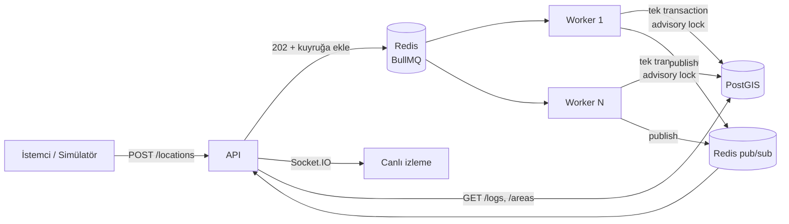

# Location Tracking Service

Mobil uygulamadaki kullanıcıların yaklaşık 5 saniyede bir gönderdiği konumları alır. Konumun tanımlı polygon alanlardan birine girip girmediğini tespit eder ve girişi kaydeder; kullanıcı alandan çıktığında aynı kayda çıkış zamanını da ekler. Trafik artışını karşılayacak şekilde tasarlandı: istekler kuyruğa alınır, ayrı worker süreçleri işler.

Yanında bir demo arayüzü de var:
- **Fake GPS simülatörü:** scooter'ı haritada sürüklersiniz ya da rota çizip oynatırsınız.
- **Canlı izleme ekranı:** başka bir sekmede scooter'ları ve giriş/çıkış olaylarını anlık gösterir.

| | |
|---|---|
| Backend | NestJS 12, TypeScript |
| Veritabanı | PostgreSQL 17 + PostGIS 3.5 |
| ORM | TypeORM 1.x |
| Kuyruk | BullMQ 6 + Redis 8 |
| Canlı yayın | Socket.IO + Redis pub/sub |
| Arayüz | React 19, Vite 8, Leaflet |

## Hızlı başlangıç

```bash
docker compose up -d --build        # postgis, redis, migrate, api, 2 worker, web
cd api && npm ci && npm run seed    # Kadıköy/Moda çevresinde 10 örnek alan
```

- API ve Swagger: http://localhost:3000/docs
- Demo arayüzü: http://localhost:8080. Bir sekmede **Simülatör**, diğerinde **Canlı izleme** açın.
- Sağlık ve kuyruk durumu: http://localhost:3000/health

> Postgres host'ta **5444**, Redis **6390** portundan açılır. Bu makinede 5432, 5433 ve 6379 başka servislerce kullanılıyordu.

## Mimari



- **API** (`api/src/main.ts`): İsteği doğrular, konumu kuyruğa ekler ve hemen `202` döner. Veritabanına yazmaz, bu yüzden ani yüklerde de hızlı kalır.
- **Worker** (`api/src/worker.ts`): Aynı kod tabanından, HTTP sunucusu olmadan çalışır. `docker compose up --scale worker=N` ile yatayda çoğaltılır.
- **Realtime:** Worker'lar işlenmiş konumu Redis'e yayınlar. Her API instance kendi aboneliğiyle Socket.IO client'larına iletir; bu sayede API birden fazla instance'a çoğaltıldığında da çalışır.

## API

| Endpoint | Açıklama |
|---|---|
| `POST /locations` | `{ userId, lat, lng, timestamp }`. Hepsi zorunlu, `timestamp` ISO 8601. Kuyruğa alınır, `202 { jobId, recordedAt }` döner. |
| `GET /logs` | Alan girişleri, en yeni girişten eskiye. Filtreler: `userId`, `areaId`, `active` (hâlâ içeride mi), `from`/`to` (giriş zamanı aralığı). Sayfalama: `limit`, `cursor`. |
| `POST /areas` | `{ name, type, geometry }`. Geometri GeoJSON Polygon, koordinatlar `[boylam, enlem]`. |
| `GET /areas` | Tanımlı alanlar. Opsiyonel `type` filtresi. |
| `GET /locations/latest` | Son bilinen konumlar (canlı izleme ekranının ilk yüklemesi için). |
| `GET /health` | DB, Redis ve kuyruk sayaçları. |

Alan tipleri scooter operasyonundan geliyor: `NO_RIDE` (sürüş yasak), `SLOW` (yavaş bölge), `NO_PARKING` (park yasak), `PARKING` (park alanı), `SERVICE` (hizmet bölgesi).

```bash
curl -X POST localhost:3000/areas -H 'content-type: application/json' -d '{
  "name": "Moda Sahil", "type": "NO_RIDE",
  "geometry": {"type": "Polygon", "coordinates": [[[29.02,40.98],[29.03,40.98],[29.03,40.99],[29.02,40.99],[29.02,40.98]]]}
}'
curl -X POST localhost:3000/locations -H 'content-type: application/json' \
  -d '{"userId": "scooter-1", "lat": 40.985, "lng": 29.025, "timestamp": "2026-09-26T10:00:00Z"}'
curl 'localhost:3000/logs?userId=scooter-1'
```

`GET /logs` yanıtı:

```json
{
  "data": [
    { "id": "2", "userId": "scooter-1", "areaId": "…", "areaName": "Moda Sahil", "areaType": "NO_RIDE",
      "entryTime": "2026-09-26T10:00:00.000Z", "exitTime": null }
  ],
  "nextCursor": null
}
```

## Teknoloji tercihleri

- **PostGIS (PostgreSQL eklentisi):** Nokta-içinde-polygon kontrolü veritabanında, index kullanarak yapılır. Uygulama belleğinde yapmak da mümkündü, ama birden fazla worker'ın alan listesini tutarlı tutması ayrı bir problem olurdu. PostGIS ayrı bir servis değil; primary database yine PostgreSQL.
- **Redis + BullMQ:** Konum trafiği her kullanıcı için 5 saniyede bir, yani aktif kullanıcı sayısıyla doğru orantılı büyür. API isteği kuyruğa atıp hemen döndüğü için veritabanı yavaşlasa ya da ani bir yük gelse de istemciler beklemez. İşleme tarafı API'den bağımsız olarak ölçeklenir. Başarısız işler otomatik olarak tekrar denenir.
- **TypeORM:** PostGIS `geometry` kolonunu doğrudan destekliyor. Prisma'da bu kolon `Unsupported` kalıyor ve coğrafi sorguların hepsi ham SQL'e dönüşüyordu.
- **Socket.IO:** Sadece demo arayüzündeki canlı izleme için var; servisin temel işleyişi buna bağlı değil (`REALTIME_ENABLED=false` ile kapatılabilir).

## Tasarım kararları

**Her log kaydı bir giriştir.** Kullanıcı alanın içindeyken gönderdiği konumlar yeni kayıt üretmez; sadece dışarıdan içeri geçiş yeni bir kayıt açar (`entryTime`). Kullanıcı alandan çıktığında aynı kaydın `exitTime`'ı doldurulur. Çıkıp tekrar giren kullanıcı için yeni bir kayıt açılır. `exitTime`'ı boş olan kayıtlar kullanıcının şu an içinde olduğu alanlardır, bu yüzden ayrı bir durum tablosuna gerek yok. `(user_id, area_id) WHERE exit_time IS NULL` üzerindeki unique partial index, aynı alanda iki açık giriş oluşmasını veritabanı seviyesinde de engeller. Giriş zamanı sunucunun saati değil, konumun cihazda ölçüldüğü `timestamp`'tir.

**Coğrafi hesap PostGIS'te yapılır.** Alanlar `geometry(Polygon, 4326)` olarak saklanır ve **GiST index**'lidir. `ST_Contains` sorgusu önce index'teki sınırlayıcı kutularla adayları daraltır. Böylece alan sayısı binlere çıksa da her konum için tüm poligonlar taranmaz. Bir poligonun kendini kesmesi gibi geometrik hatalar `ST_IsValid` ile yakalanır ve `400` döner.

**Eşzamanlılık ve sıra.** Kuyruk yüzünden aynı scooter'ın iki konumu iki farklı worker'da aynı anda işlenebilir. Bir konumun işlenmesi (`api/src/geofence/geofence.service.ts`) tek bir transaction içinde şu adımlardan oluşur:

1. `pg_advisory_xact_lock(hashtextextended(user_id))`: aynı kullanıcının konumları sırayla işlenir, farklı kullanıcılar birbirini beklemez.
2. Konum, kullanıcının son işlenen konumundan eskiyse atlanır. Ağda gecikip geç gelen eski bir konum durumu geriye götürmez.
3. Noktayı içeren alanlar, açık girişler ve son konum zamanı **tek sorguda** okunur.
4. Fark hesaplanır. Yeni girişler, çıkışlar ve son konum **tek bir CTE sorgusuyla** yazılır.

`test/geofence.e2e-spec.ts` testi aynı konumun 50 kopyasını paralel işler ve tam 1 giriş beklendiğini doğrular. Kilit kaldırıldığında test kırmızıya düşüyor: 50 kopyanın 20'si ayrı ayrı işlendi ve mükerrer log oluştu. Yani test gerçek bir hatayı yakalıyor.

**İleri tarihli konumlar reddedilir.** `timestamp` sunucu saatinden 60 saniyeden fazla ilerideyse istek `400` alır. Aksi halde bu konum, sonraki gerçek konumların "eski" sayılıp atlanmasına yol açardı.

**Loglarda keyset sayfalama.** `GET /logs` OFFSET yerine `(entry_time, id)` cursor'ı kullanır. Log tablosu trafikle birlikte hızla büyüyeceği için bu önemli: sayfa derinleştikçe sorgu yavaşlamaz ve `(user_id | area_id, entry_time DESC, id DESC)` index'lerini doğrudan kullanır.

**Kuyruk ayarları.** Başarısız işler 3 kez, üstel artan bekleme süresiyle tekrar denenir. Tamamlanan işler Redis'te birikmez (`removeOnComplete`). Worker `concurrency` değeri env ile ayarlanır.

## Performans

`loadtest/run.sh` k6'yı compose ağı içinde çalıştırır: 5.000 farklı scooter, 70 saniyede 2.000 istek/sn'ye çıkan yük. Ardından kuyruğun boşalma süresini ölçer.

```bash
PEAK_RPS=2000 WORKERS=2 ./loadtest/run.sh
```

Ortam: MacBook, Docker VM'e ayrılmış **2 vCPU / 2 GB RAM**. API, worker'lar, Postgres, Redis ve k6 bu 2 CPU'yu paylaşıyor.

| Koşu | Worker | İstek | Hata | p50 | p95 | p99 | Ortalama işleme | Yük sonrası boşalma |
|---|---|---|---|---|---|---|---|---|
| 1 | 2 | 100.749 | %0 | 1,0 ms | 10,9 ms | 21,8 ms | 1.259 konum/sn | 7 sn |
| 2 | 2 | 100.687 | %0 | 1,0 ms | 14,2 ms | 30,4 ms | 1.274 konum/sn | 7 sn |
| 3 | 1 | 100.662 | %0 | 1,2 ms | 15,5 ms | 44,5 ms | 1.258 konum/sn | 9 sn |

Üçüncü koşu, log modelinin ziyaret kaydına çevrilmesinden önce yapıldı; yazma sorgusu değiştiği için ilk iki koşu yeniden ölçüldü.

**5 saniyelik gönderim sıklığına göre kapasite:** Kullanıcı başına saniyede 0,2 konum düşüyor. Ölçülen ortalama işleme hızı (~1.270 konum/sn) bu 2 vCPU'luk ortamda sürekli olarak yaklaşık **6.300 eşzamanlı aktif kullanıcıya** karşılık geliyor. Bunun üzerindeki ani yüklerde API hâlâ cevap veriyor, fark kuyrukta birikip sonra eritiliyor.

Sonuçların yorumu:
- **API'nin gecikmesi işleme hızından bağımsız.** Tepe yükte işler kuyrukta birikiyor (en fazla yaklaşık 40 bin), ama API cevap vermeye devam ediyor ve kuyruk yük bittikten saniyeler sonra boşalıyor. Kuyruk mimarisinin amacı da buydu.
- **Bu makinede darboğaz CPU.** Test sırasında toplam CPU kullanımı %190 civarındaydı ve bunun en büyük payı Postgres'teydi (yaklaşık %71). Bu yüzden 1 worker ile 2 worker aynı hızda işledi. Daha fazla CPU'lu bir ortamda worker ve Postgres kaynakları artırıldıkça işleme hızı da artar; buradaki sayılar alt sınır.
- Konteynerler yeni başladığında yapılan ilk koşuda p95 325 ms'ye kadar çıkabiliyor (JIT ısınması ve bağlantı havuzlarının açılması).

## Testler

```bash
cd api
npm test            # birim testleri (30)
npm run test:e2e    # gerçek PostGIS + Redis ile e2e (15); compose'daki postgres/redis açık olmalı
npm run lint
```

e2e testleri ayrı bir veritabanı (`geofence_test`) ve ayrı bir kuyruk öneki kullanır, geliştirme verisine dokunmaz. Kapsanan konular:
- Giriş, çıkış (`exitTime`) ve içeride kalma
- Çıkıp tekrar girişte yeni kayıt
- Sırası karışık gelen konum
- Eksik veya ileri tarihli `timestamp`
- 50 paralel istekte tek giriş
- Farklı kullanıcıların birbirinden bağımsızlığı
- Poligon doğrulama
- Cursor sayfalamanın tekrar ve boşluk bırakmaması
- Filtreler

## Demo arayüzü (case kapsamı dışında)

Case bir arayüz istemiyor; bu kısım servisi uçtan uca görmek ve sunumda göstermek için eklendi.

- **Simülatör:** Scooter'ı sürükleyin ya da "Rota çiz" ile haritaya duraklar ekleyip oynatın. Bir bölgeye girip çıkıldığında sürücünün göreceği bildirim trafik levhası olarak belirir. Örneğin sürüş yasak bölgede kırmızı "girilmez" levhası, yavaş bölgede "10" levhası. "Arka plan trafiği" ile 300'e kadar bot, bölgede rastgele dolaşarak saniyede bir konum gönderir.
- **Canlı izleme:** Tüm scooter'lar, bulundukları bölgeye göre renklenir. Yanında anlık sayaçlar ve giriş/çıkış akışı var; bir satıra tıklamak haritayı o scooter'a götürür. Konumlar yük altında tarayıcıyı boğmasın diye sunucuda 200 ms'lik gruplar halinde gönderilir. Tarayıcıda da React state'ine girmeden doğrudan Leaflet katmanında güncellenir.
- **Alanlar:** Çokgen veya dikdörtgen çizip adını ve tipini seçerek `POST /areas` ile kaydedilir. Çizim aracı sadece bu ekranda yüklenir.

## Yerel geliştirme (Docker'sız API)

```bash
docker compose up -d postgres redis
cd api && cp .env.example .env
npm run migration:run
npm run start:dev                 # API :3000
npm run start:worker:dev          # ayrı terminalde worker
cd ../web && npm ci && npm run dev  # arayüz :5173 (API'ye proxy'ler)
```

## Proje yapısı

```
api/src/
  areas/        POST/GET /areas, GeoJSON doğrulama
  locations/    POST /locations (kuyruğa atar), GET /locations/latest
  geofence/     giriş/çıkış tespiti (servis + BullMQ processor)
  logs/         GET /logs (giriş kayıtları), keyset sayfalama
  realtime/     Redis pub/sub → Socket.IO
  database/     TypeORM ayarları, migration, migrate scripti
api/test/       e2e testleri
web/src/        simülatör, canlı izleme, alan editörü
loadtest/       k6 senaryosu ve çalıştırma scripti
```

## Bilinçli olarak kapsam dışı bırakılanlar

Bunlar production için sıradaki adımlar olur:

- **Kimlik doğrulama ve rate limiting.** Şu an `userId` istek gövdesinden alınıyor.
- **`area_logs` tablosunun zamana göre partition'lanması** ve eski logların arşivlenmesi.
- **Toplu konum endpoint'i** (`POST /locations/batch`). Mobil istemci, bağlantı koptuğunda biriktirdiği konumları tek istekte gönderebilir.
- **Alan güncelleme ve silme.** Bir alanın geometrisi değişince içinde bulunan kullanıcıların durumunun yeniden hesaplanması gerekir.
- **Canlı yayın güvenilirliği.** Yayın şu an "en iyi çaba" ile yapılıyor; log zaten DB'de olduğu için veri kaybı yok. Yayının garanti olması gerekirse outbox deseni kullanılabilir.
- **Metrikler.** Prometheus ile kuyruk derinliği ve işleme süresi.

## Claude Code skill'leri

Projeye şu skill'ler kuruldu (`.claude/skills/`, sürümler `skills-lock.json` içinde):

- `find-skills`: yeni ihtiyaçlar için skill aramak
- `frontend-design`: arayüzün görsel dili (trafik levhası teması, Overpass fontu)
- `vercel-react-best-practices`: React tarafında performans kuralları (ref ile güncellenen harita katmanı, çizim aracının ayrı pakete bölünmesi, tek socket bağlantısı)

Yeni bir makinede aynı skill'leri kurmak için:

```bash
npx skills add https://github.com/vercel-labs/skills --skill find-skills
npx skills add https://github.com/anthropics/skills --skill frontend-design
npx skills add https://github.com/vercel-labs/agent-skills --skill vercel-react-best-practices
```
