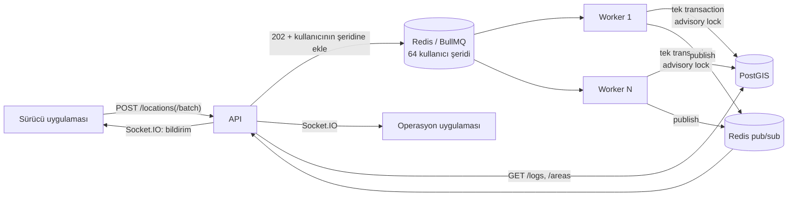

# Location Tracking Service

Mobil uygulamadaki kullanıcıların yaklaşık 5 saniyede bir gönderdiği konumları alır. Konumun tanımlı polygon alanlardan birine girip girmediğini tespit eder ve girişi kaydeder; kullanıcı alandan çıktığında aynı kayda çıkış zamanını da ekler. Trafik artışını karşılayacak şekilde tasarlandı: istekler kuyruğa alınır, ayrı worker süreçleri işler.

Yanında servisle veri alışverişi yapan iki istemci de var (case kapsamı dışında, demo için):
- **Sürücü uygulaması:** Gerçek bir cihaz gibi 5 saniyede bir konum gönderir; bir bölgeye girip çıkınca beklemeden gönderir. Çevrimdışıyken konumları biriktirir, bağlanınca toplu yollar.
- **Operasyon uygulaması:** Canlı harita, giriş kayıtları ve alan yönetimi.

| | |
|---|---|
| Backend | NestJS 12, TypeScript |
| Veritabanı | PostgreSQL 17 + PostGIS 3.5 |
| ORM | TypeORM 1.x |
| Kuyruk | BullMQ 6 + Redis 8 |
| Canlı yayın | Socket.IO + Redis pub/sub |
| Arayüz | React 19, Vite 8, Leaflet |

## Hızlı başlangıç

```bash
docker compose up -d --build        # postgis, redis, migrate, api, 2 worker, ops, driver
cd api && npm ci && npm run seed    # Kadıköy/Moda çevresinde 10 örnek alan
```

- API ve Swagger: http://localhost:3000/docs. Yerel demo anahtarları: tam yetkili `dev-api-key` (operasyon, betikler) ve sadece konum gönderebilen `dev-driver-key` (sürücü uygulaması). Swagger'da "Authorize" ile girilir.
- Operasyon uygulaması: http://localhost:8080
- Sürücü uygulaması: http://localhost:8081. İkisini yan yana açıp sürücüde "Sürüşü başlat" deyin.
- Sağlık ve kuyruk durumu: http://localhost:3000/health
- Metrikler: http://localhost:3000/metrics (API), worker'larda `:9100/metrics`

> Postgres host'ta **5444**, Redis **6390** portundan açılır. Bu makinede 5432, 5433 ve 6379 başka servislerce kullanılıyordu.

## Mimari



- **API** (`api/src/main.ts`): İsteği doğrular, konumu kuyruğa ekler ve hemen `202` döner. Veritabanına yazmaz, bu yüzden ani yüklerde de hızlı kalır.
- **Worker** (`api/src/worker.ts`): Aynı kod tabanından, HTTP sunucusu olmadan çalışır. `docker compose up --scale worker=N` ile yatayda çoğaltılır. Kuyruk kullanıcılara göre şeritlere bölünmüştür: aynı kullanıcının işleri tek tek, geliş sırasıyla işlenir, farklı şeritler paralel ilerler (bkz. Tasarım kararları).
- **Realtime:** Worker'lar işlenmiş konumu Redis'e yayınlar. Her API instance kendi aboneliğiyle Socket.IO client'larına iletir; bu sayede API birden fazla instance'a çoğaltıldığında da çalışır.

## API

| Endpoint | Açıklama |
|---|---|
| `POST /locations` | `{ userId, lat, lng, timestamp }`. Hepsi zorunlu, `timestamp` ISO 8601. Kuyruğa alınır, `202 { jobId, recordedAt }` döner (`jobId` "şerit:iş" biçiminde, ör. `17:123`). |
| `POST /locations/batch` | `{ locations: [...] }`, en fazla 100 konum. Bağlantı koptuğunda biriken konumlar için. Doğrulama hepsi-ya-hiçbiri; `202 { accepted, jobIds }`. |
| `GET /logs` | Alan girişleri, en yeni girişten eskiye. Filtreler: `userId`, `areaId`, `active` (hâlâ içeride mi), `from`/`to` (giriş zamanı aralığı). Sayfalama: `limit`, `cursor`. |
| `POST /areas` | `{ name, type, geometry }`. Geometri GeoJSON Polygon, koordinatlar `[boylam, enlem]`. |
| `GET /areas` | Tanımlı alanlar. Opsiyonel `type` filtresi. |
| `GET /locations/latest` | Son bilinen konumlar (canlı izleme ekranının ilk yüklemesi için). |
| `GET /health` | DB, Redis ve kuyruk sayaçları. Anahtar istemez. |
| `GET /metrics` | Prometheus metrikleri. Anahtar istemez; dışarıya açılmamalı. |

Health ve metrics dışındaki tüm uç noktalar `x-api-key` başlığı ister. Sürücü anahtarı (`INGEST_API_KEYS`) sadece `POST /locations`, `POST /locations/batch` ve `GET /areas`'a erişir. Olası hata yanıtları:
- `400`: doğrulama hatası
- `401`: anahtar eksik veya yanlış
- `403`: sürücü anahtarı bu uç noktaya yetkili değil
- `429`: kullanıcı başına dakikalık sınır aşıldı
- `503`: kuyruk dolu

`429` ve `503` yanıtları `Retry-After` başlığıyla gelir; istemci o kadar saniye bekleyip tekrar dener.

Alan tipleri scooter operasyonundan geliyor: `NO_RIDE` (sürüş yasak), `SLOW` (yavaş bölge), `NO_PARKING` (park yasak), `PARKING` (park alanı), `SERVICE` (hizmet bölgesi).

```bash
export H='x-api-key: dev-api-key'
curl -X POST localhost:3000/areas -H "$H" -H 'content-type: application/json' -d '{
  "name": "Moda Sahil", "type": "NO_RIDE",
  "geometry": {"type": "Polygon", "coordinates": [[[29.02,40.98],[29.03,40.98],[29.03,40.99],[29.02,40.99],[29.02,40.98]]]}
}'
curl -X POST localhost:3000/locations -H "$H" -H 'content-type: application/json' \
  -d '{"userId": "scooter-1", "lat": 40.985, "lng": 29.025, "timestamp": "2026-09-26T10:00:00Z"}'
curl -H "$H" 'localhost:3000/logs?userId=scooter-1'
```

`GET /logs` yanıtı:

```json
{
  "data": [
    { "id": "2", "userId": "scooter-1", "areaId": "…", "areaName": "Moda Sahil", "areaType": "NO_RIDE",
      "entryTime": "2026-09-26T10:00:00.000Z", "exitTime": null }
  ],
  "nextCursor": null
}
```

## Teknoloji tercihleri

- **PostGIS (PostgreSQL eklentisi):** Nokta-içinde-polygon kontrolü veritabanında, index kullanarak yapılır. Uygulama belleğinde yapmak da mümkündü, ama birden fazla worker'ın alan listesini tutarlı tutması ayrı bir problem olurdu. PostGIS ayrı bir servis değil; primary database yine PostgreSQL.
- **Redis + BullMQ:** Konum trafiği her kullanıcı için 5 saniyede bir, yani aktif kullanıcı sayısıyla doğru orantılı büyür. API isteği kuyruğa atıp hemen döndüğü için veritabanı yavaşlasa ya da ani bir yük gelse de istemciler beklemez. İşleme tarafı API'den bağımsız olarak ölçeklenir. Başarısız işler otomatik olarak tekrar denenir.
- **TypeORM:** PostGIS `geometry` kolonunu doğrudan destekliyor. Prisma'da bu kolon `Unsupported` kalıyor ve coğrafi sorguların hepsi ham SQL'e dönüşüyordu.
- **Socket.IO:** Sadece demo istemcilerindeki canlı bildirim ve izleme için var; servisin temel işleyişi buna bağlı değil (`REALTIME_ENABLED=false` ile kapatılabilir).
- **prom-client:** Prometheus metrikleri için standart Node kütüphanesi. Loglar için ek paket kullanılmadı; NestJS'in kendi logger'ı JSON modunda çalışıyor.

## Varsayımlar

- **Timestamp cihaz saatidir.** Giriş zamanı olarak sunucunun isteği aldığı an değil, konumun ölçüldüğü an kaydedilir. Cihaz saati sunucudan en fazla 60 saniye ileride olabilir.
- **Eski konumlar atlanır.** Bir kullanıcının son işlenen konumundan daha eski bir konum gelirse, örneğin ağda gecikmişse, durumu geriye götürmesin diye yok sayılır.
- **Alanlar çakışabilir.** Bir konum birden fazla alanın içindeyse her alan için ayrı giriş kaydı açılır.
- **Polygon delikleri desteklenir.** GeoJSON'daki iç halkalar (hole) alanın dışı sayılır. Tam sınır çizgisi üzerindeki nokta içeride sayılmaz (`ST_Contains`); gerçek GPS verisinde bunun pratik bir etkisi yok.
- **`userId` opak bir kimliktir.** Kullanıcı yönetimi bu servisin sorumluluğunda değil; kimliğin doğruluğu çağıran tarafa (mobil backend veya gateway) bırakıldı.
- **Alanlar az sayıdadır ve seyrek değişir.** Binler mertebesinde olması beklenir, bu yüzden `GET /areas` sayfalanmaz. Log tablosu ise hızla büyüyeceği için sayfalanır.
- **ORM kullanımı:** Alan kaydı ve okuma TypeORM repository ile yapılır. Konum işleme ve log sorguları ise performans için TypeORM üzerinden ham SQL ile yazıldı; tek sorguda okuma, CTE ile tek sorguda yazma ve keyset sayfalama ORM sorgu kurucusuyla ifade edilemiyor.

## Tasarım kararları

**Her log kaydı bir giriştir.** Kullanıcı alanın içindeyken gönderdiği konumlar yeni kayıt üretmez; sadece dışarıdan içeri geçiş yeni bir kayıt açar (`entryTime`). Kullanıcı alandan çıktığında aynı kaydın `exitTime`'ı doldurulur. Çıkıp tekrar giren kullanıcı için yeni bir kayıt açılır. `exitTime`'ı boş olan kayıtlar kullanıcının şu an içinde olduğu alanlardır, bu yüzden ayrı bir durum tablosuna gerek yok. `(user_id, area_id) WHERE exit_time IS NULL` üzerindeki unique partial index, aynı alanda iki açık giriş oluşmasını veritabanı seviyesinde de engeller. Giriş zamanı sunucunun saati değil, konumun cihazda ölçüldüğü `timestamp`'tir.

**Coğrafi hesap PostGIS'te yapılır.** Alanlar `geometry(Polygon, 4326)` olarak saklanır ve **GiST index**'lidir. `ST_Contains` sorgusu önce index'teki sınırlayıcı kutularla adayları daraltır. Böylece alan sayısı binlere çıksa da her konum için tüm poligonlar taranmaz. Bir poligonun kendini kesmesi gibi geometrik hatalar `ST_IsValid` ile yakalanır ve `400` döner.

**Eşzamanlılık ve sıra.** Aynı kullanıcının işleri kuyrukta tek tek işlenir (bkz. kullanıcı şeritleri, aşağıda). Veritabanı tarafı yine de buna güvenmez: kilidi düştüğü için başka worker'a verilmiş bir iş, eski worker'da hâlâ sürüyor olabilir. Bir konumun işlenmesi (`api/src/geofence/geofence.service.ts`) tek bir transaction içinde şu adımlardan oluşur:

1. `pg_advisory_xact_lock(hashtextextended(user_id))`: aynı kullanıcının konumları sırayla işlenir, farklı kullanıcılar birbirini beklemez.
2. Konum, kullanıcının son işlenen konumundan eskiyse atlanır. Ağda gecikip geç gelen eski bir konum durumu geriye götürmez.
3. Noktayı içeren alanlar, açık girişler ve son konum zamanı **tek sorguda** okunur.
4. Fark hesaplanır. Yeni girişler, çıkışlar ve son konum **tek bir CTE sorgusuyla** yazılır.

`test/geofence.e2e-spec.ts` testi aynı konumun 50 kopyasını servis seviyesinde paralel işler ve tam 1 giriş beklendiğini doğrular. Kilit kaldırıldığında test kırmızıya düşüyor: 50 kopyanın 20'si ayrı ayrı işlendi ve mükerrer log oluştu. Yani test gerçek bir hatayı yakalıyor.

**İleri tarihli konumlar reddedilir.** `timestamp` sunucu saatinden 60 saniyeden fazla ilerideyse istek `400` alır. Aksi halde bu konum, sonraki gerçek konumların "eski" sayılıp atlanmasına yol açardı.

**Loglarda keyset sayfalama.** `GET /logs` OFFSET yerine `(entry_time, id)` cursor'ı kullanır. Log tablosu trafikle birlikte hızla büyüyeceği için bu önemli: sayfa derinleştikçe sorgu yavaşlamaz ve `(user_id | area_id, entry_time DESC, id DESC)` index'lerini doğrudan kullanır.

**Ayarlar açılışta doğrulanır.** Ortam değişkenleri servis ayağa kalkmadan kontrol edilir. Verilmeyen değer için varsayılan kullanılır. Verilen ama geçersiz bir değer (ör. `DB_PORT=abc`, `REDIS_URL=http://...`, hatalı `CORS_ORIGINS`) sessizce varsayılana düşmez: servis bütün sorunları birlikte listeleyip 1 koduyla çıkar. Production'da API sunucusu `API_KEYS` olmadan ve 16 karakterden kısa bir anahtarla açılmaz. Worker, migration ve smoke betikleri anahtar kullanmadığı için bu kural onlara uygulanmaz.

**Kuyruk ayarları.** Tamamlanan işler Redis'te birikmez: incelemek için tamamlananların son ~1.000'i, başarısızların son ~5.000'i tutulur (`QUEUE_KEEP_COMPLETED`, `QUEUE_KEEP_FAILED`). BullMQ bu sınırları kuyruk başına uyguladığı için şeritlere bölünür; bölünmeseydi 64 şerit 64 kat iş biriktirirdi (yük testinden sonra 64 bin iş, 84 MB). Yeniden deneme ve eşzamanlılık şerit tasarımının parçası (aşağıda).

**Toplu istekte sıra korunur.** Toplu istekteki konumlar kullanıcı başına tek işte, zamana göre sıralı tutulur ve worker bunları sırayla işler. Ayrı işler olsalardı paralel worker'lar yeni noktayı eskiden önce işleyebilirdi. O zaman eski nokta "geç gelmiş" sayılıp atlanır ve bir alan girişi kaçabilirdi; e2e testi bu durumu ters sırada gönderilen noktalarla doğruluyor.

**Aynı kullanıcının ayrı istekleri de sırayla işlenir: kullanıcı şeritleri.** Uzun bir kopukluktan sonra cihaz birikmiş konumları 100'lük istekler halinde art arda gönderir. Her istek ayrı bir iştir. Paralel worker'lar sonrakini öncekinden önce işlerse öncekinin noktaları "eski" sayılıp atlanır ve aradaki girişler/çıkışlar kaybolur. Bu yüzden kuyruk şeritlere bölündü (`QUEUE_LANES`, varsayılan 64; `api/src/queue/location-lanes.ts`):

- Her kullanıcı `userId`'nin hash'iyle (FNV-1a) hep aynı şeride düşer.
- Şeritte aynı anda tek iş çalışır. Bu sınır BullMQ'nun kuyruk düzeyindeki global concurrency ayarıyla Redis'te uygulanır; worker süreci sayısından bağımsızdır.
- Farklı şeritler paralel ilerler: aynı anda en fazla 64 iş işlenir, önceki 2 worker × 32 ayarıyla aynı paralellik.
- Bedeli: yavaş bir iş aynı şeritteki diğer kullanıcıları (yaklaşık 1/64'ünü) bekletir. En dolu şeridin derinliği ayrı bir metrik olarak yayınlanır (`location_lane_backlog_max`).
- Yeniden deneme işin içinde yapılır: nokta başına 3 deneme, aralarında 200 ve 400 ms (`WORKER_POINT_ATTEMPTS`, `WORKER_RETRY_DELAY_MS`). BullMQ'nun kendi yeniden denemesi işi şeridin sonuna atar ve sonraki iş öne geçerdi. Denemeleri tükenen iş başarısız sayılır, şerit hemen sıradaki işle devam eder.
- Şerit sayısı API ve worker'da aynı olmalı. İlk açılan süreç sayıyı Redis'e yazar (`<önek>:lanes`); farklı sayıyla açılan worker açılmayı reddeder, API hatayı loglar. Değiştirmek için API durdurulur, kuyruk boşalınca bu anahtar silinir ve tüm süreçler yeni değerle açılır.
- Şeritlerden önceki tek kuyrukta güncelleme sırasında kalmış işler de worker tarafından işlenir.

`test/lanes.e2e-spec.ts` iki worker'ı aynı şeride bağlar ve işlerin hiç üst üste binmediğini, geliş sırasıyla işlendiğini doğrular. Global sınır kaldırıldığında test kırmızıya düşüyor.

Önceki tasarım tek kuyruk ve kullanıcı başına sıra numarasıyla çalışıyordu: sırası gelmemiş iş erteleniyor, önceki bitince öne alınıyordu. İnceleme iki sorun buldu. Öne alınan iş aslında kuyruğun sonuna düşüyordu ve 30 saniyelik "takıldı" kuralı yavaş ama çalışan işi de geçiyordu. Yük testinde işleme hızı da yarıya inmişti (bkz. Performans).

**Çöken worker'ın işi başkasına geçer.** Worker işin kilidini 10 saniyede bir yeniler. Süreç çöker ya da Redis'e ulaşamazsa kilit 20 saniye içinde düşer. Diğer worker'lar 5 saniyede bir kilidi düşmüş iş arar ve bulduğunu şeridin önüne geri koyar. Böylece şerit en fazla ~30 saniye bekler ve sıra bozulmaz: iş baştan işlenir, önceden işlenmiş noktaları "eski" sayılıp atlanır (`WORKER_LOCK_MS`, `WORKER_STALLED_CHECK_MS`). e2e testi takılan worker'ı kapatır; işin sırası bozulmadan diğer worker'da bittiğini doğrular.

**Kuyruk dolarsa yük reddedilir (backpressure).** Worker'lar uzun süre yetişemezse kuyruk sınırsız büyüyüp Redis belleğini doldururdu. Tüm şeritlerde bekleyen iş sayısı `QUEUE_MAX_BACKLOG`'u (varsayılan 200.000) aşınca API yeni konumları `503 Retry-After: 5` ile reddeder. Kuyruk derinliği her istekte sorulmaz; saniyede bir arka planda okunur, böylece sıcak yola ek bir Redis çağrısı eklenmez.

## Veritabanı

Tasarım kararları, 3 milyon giriş kaydı ve 50 bin kullanıcılı ayrı bir bench veritabanında ölçülerek verildi. Aynı ölçümler `./loadtest/db-bench/run.sh` ile tekrarlanabilir.

**Okuma sorguları ölçekleniyor.** 3 milyon kayıtta `GET /logs`'un bütün filtre çeşitleri, derin sayfalar ve worker'ın konum başına okuması 2 ms'nin altında. Hepsi uygun index'i kullanıyor ve keyset sayfalama sayesinde sayfa derinliği hızı etkilemiyor.

**Açık girişler için kısmi index.** "Hâlâ içeride" filtresiyle listenin sonuna gelindiğinde veritabanı tüm tabloyu tarıyordu (2,27 sn). Sadece açık girişleri kapsayan index (`WHERE exit_time IS NULL`, 544 KB) bunu 0,04 ms'ye indirdi.

**Son konum güncellemeleri HOT.** `user_last_location` her konumda güncellenir. `recorded_at` üzerindeki index bu güncellemelerin index'e dokunmadan yapılmasını (HOT) engelliyordu: HOT oranı %0'dı ve tablo 30 saniyelik yükte 5 MB'tan 15 MB'a şişiyordu. Index kaldırıldı ve sayfalarda güncelleme payı bırakıldı (`fillfactor=70`); HOT oranı %100 oldu, şişme durdu ve worker transaction'ı %6,5 hızlandı. Bu index'i kullanan tek sorgu (`GET /locations/latest`) artık tabloyu tarıyor; 50 bin kullanıcıda 11 ms sürüyor ve sadece operasyon ekranı açılırken çalışıyor. `fillfactor` yeni sayfalara uygulanır: var olan bir kurulumda etkisi için tablo bir kez `VACUUM FULL user_last_location` ile yeniden yazılmalı. Migration bunu kilit tutmamak için kendisi yapmaz.

**Dayanıklılık: giriş kayıtları kaybolmaz.** `synchronous_commit` varsayılan (açık) ayarında. Giriş veya çıkış üretmeyen konumlarda, ki bunlar konumların çoğu, uygulama transaction içinde `SET LOCAL synchronous_commit = off` kullanır. Bir çökmede kaybolabilecek tek şey son konumdur ve bir sonraki konumla (5 sn) zaten yenilenir. Giriş kayıtları her zaman diske yazılarak onaylanır. Redis kuyruğu da diske yazılır (AOF, saniyede bir).

| Mod (worker transaction'ı, pgbench, 8 istemci) | Saniyede transaction | Giriş kayıtları çökmede |
|---|---|---|
| Tamamen dayanıklı | 4.883 | korunur |
| **Karma (uygulamadaki)** | **5.810** | **korunur** |
| Tamamen kapalı (önceki ayar) | 6.008 | kaybolabilir |

**Zaman aşımları.** Her bağlantı `statement_timeout` (varsayılan 5 sn, `DB_STATEMENT_TIMEOUT_MS`) ve `idle_in_transaction_session_timeout` (varsayılan 30 sn, `DB_IDLE_TX_TIMEOUT_MS`) ile açılır. Takılan bir sorgu ya da açık bırakılmış bir transaction bağlantıyı ve kilitleri süresiz tutamaz. Migration'larda sorgu süresi sınırı yok.

**Index'leri kilitlemeden oluşturma.** Yeni index'ler `CREATE INDEX CONCURRENTLY` ile eklenir; büyük tabloda yazmalar durmaz. Bu yüzden ilgili migration transaction dışında çalışır.

**Büyüme.** 1 milyon giriş kaydı index'lerle birlikte yaklaşık 255 MB tutar. Index'ler tablonun kendisinden büyük, çünkü üç farklı sıralama (zaman, kullanıcı, alan) keyset sayfalamayla destekleniyor. Saklama politikası şimdilik yok; bkz. "Bilinçli olarak kapsam dışı bırakılanlar".

## Güvenlik

- **API anahtarı:** Servisin mobil uygulamanın backend'i veya bir API gateway tarafından çağrıldığı varsayıldı. İstemciler `x-api-key` ile doğrulanır. Anahtarlar sabit süreli karşılaştırılır, böylece karakter karakter tahmin edilemez. `API_KEYS` virgülle ayrılmış birden fazla anahtar alır, bu da anahtar değiştirirken eskisini kısa süre geçerli tutmayı sağlar. Tanımlı değilse doğrulama kapalıdır ve açılışta uyarı loglanır. Canlı yayın bağlantısı da aynı anahtarı el sıkışmada ister. Production'da 16 karakterden kısa anahtar kabul edilmez; bu, `dev-api-key` gibi herkesin bildiği demo anahtarlarını engeller.
- **İki yetki seviyesi:** `API_KEYS` tam yetkilidir. `INGEST_API_KEYS` ise sadece konum gönderir, alan listesini okur ve canlı yayında kullanıcı odasına abone olur. Logları okuyamaz, alan oluşturamaz, tüm filonun canlı yayınına giremez (`403`). Herkese açık bir istemcinin (sürücü uygulaması) anahtarı sızsa bile zarar sınırlı kalır.
- **Sürücü bağlantısı tek odada:** Sürücü anahtarıyla açılan bir canlı yayın bağlantısı aynı anda tek kullanıcı odasında durur; yeni kullanıcıya abone olunca öncekinden çıkarılır. Tek bağlantıyla tüm filo dinlenemez. Ama birden çok bağlantı açan biri başka kullanıcıları dinleyebilir; bunun çözümü son kullanıcı kimliğidir (bkz. kapsam dışı).
- **Ölü bağlantılar kapatılır:** Sunucu her canlı yayın bağlantısına 10 saniyede bir ping gönderir; 20 saniye içinde cevap vermeyen bağlantı kapatılır. Uygulaması kapanmış ya da ağı kopmuş cihazların bağlantıları en geç 30 saniyede temizlenir, bellekte ve oda listelerinde birikmez (`REALTIME_PING_INTERVAL_MS`, `REALTIME_PING_TIMEOUT_MS`).
- **Rate limit (kullanıcı başına):** Varsayılan dakikada 60 konum. 5 saniyede bir gönderen cihaz dakikada 12 istek atar, yani 5 kat pay var. Sınır IP'ye göre değil kullanıcıya göre uygulanır, çünkü mobil kullanıcılar operatör NAT'ı arkasında aynı IP'yi paylaşabilir. Sayaç Redis'te tutulduğu için birden fazla API instance'ı arasında ortaktır. Kontrol ve artırma tek bir Lua betiğinde atomik yapılır. Sayacı sınırın altında olan kullanıcının isteği, sınırı tek başına aşsa bile kabul edilir; aksi halde uzun kopukluktan sonra gelen 100 konumluk toplu istek, 60'lık sınırla hiç geçemez ve cihazın kuyruğu kalıcı olarak tıkanırdı. Bu yüzden bir kullanıcı dakikada en fazla 60 - 1 + 100 konum gönderebilir. Reddedilen istek kotadan düşmez. IP bazlı genel koruma API gateway veya load balancer katmanının işidir.
- **CORS:** Production'da varsayılan olarak kapalıdır; `CORS_ORIGINS` ile izin verilen adresler açıkça verilir. Demo istemcileri nginx üzerinden aynı adresten sunulduğu için CORS'a ihtiyaç duymaz.
- **Demo istemcilerinin anahtarı:** Anahtarı nginx ekler; tarayıcı kodunda görünmez. Ama bu, anahtarı saklamak anlamına gelmez: o nginx'e erişebilen herkes anahtarın yetkisiyle istek atabilir. Bu yüzden herkese açık sürücü uygulamasına sadece `INGEST_API_KEYS` yetkisi verilir. Tam yetkili operasyon uygulaması production'da iç ağda, VPN'de ya da SSO arkasında yayınlanmalıdır.
- **Demo ortamı production değil:** `docker compose` demo için `NODE_ENV=development` ve herkesin bildiği anahtarlarla çalışır. JSON log ve kapalı CORS gibi production davranışları ise compose'ta açıkça seçildi. Gerçek ortamda `NODE_ENV=production`, `API_KEY` ve `DRIVER_API_KEY` secret olarak verilir; kısa anahtarla API açılmaz.
- `x-powered-by` başlığı kapalı; doğrulamada tanımsız alan içeren istekler reddedilir.

## Gözlemlenebilirlik

- **Metrikler (Prometheus):**
  - API'de: HTTP istek süresi (rota şablonu, method, durum kodu), kabul edilen ve reddedilen konumlar (`reason`: rate_limited / backpressure), kuyruk derinliği (tüm şeritler) ve en dolu şeridin derinliği.
  - Worker'da: işleme süresi, kuyrukta bekleme süresi (`location_job_lag_seconds`), alan giriş ve çıkış sayıları, denemeleri tükenen işler.
  - Her ikisinde de Node süreç metrikleri.
  - Worker'ın HTTP API'si olmadığı için metrikleri ayrı bir portta (`WORKER_METRICS_PORT`, varsayılan 9100) yayınlanır.
- **Loglar:** Production'da tek satır JSON; log toplayıcılar doğrudan ayrıştırabilir. Seviye `LOG_LEVEL` ile, format `LOG_FORMAT=json|pretty` ile ayarlanır. Her istek için erişim logu `verbose` seviyesindedir ve varsayılan olarak kapalıdır, yük altında log hacmi patlamasın diye.
- **İstek kimliği:** Gelen `x-request-id` korunur, yoksa üretilir ve yanıtta döner. Kimlik işle birlikte kuyruğa gider; worker'daki hata logları aynı kimliği taşır, böylece bir istek API'den worker'a kadar izlenebilir.

## Performans

`loadtest/run.sh` k6'yı compose ağı içinde çalıştırır: 5.000 farklı scooter, 70 saniyede 2.000 istek/sn'ye çıkan yük. Ardından kuyruğun boşalma süresini ölçer.

```bash
PEAK_RPS=2000 WORKERS=2 ./loadtest/run.sh
```

Ortam: MacBook, Docker VM'e ayrılmış **2 vCPU / 2 GB RAM**. API, worker'lar, Postgres, Redis ve k6 bu 2 CPU'yu paylaşıyor.

> **Not (dayanıklılık değişikliğinden sonra):** Giriş kayıtları artık diske yazılarak onaylandığı için worker'ın işleme hızı bu ortamda yaklaşık %10 düştü (~1.240 → ~1.130 konum/sn). k6 senaryosu her istekte rastgele bir noktaya "ışınlandığı" için konum başına 0,43 giriş/çıkış üretir; bu, gerçek trafikten çok daha sık olduğu için bedeli en kötü haliyle gösterir. Aynı ölçümlerde API p95'i 105–250 ms arasında dalgalandı. `POST /locations` Postgres'e dokunmadığı ve Redis AOF'u kapatmak farkı kapatmadığı için bu dalgalanma, 2 CPU'yu paylaşan ve o sırada yük ortalaması 4 olan ortama bağlandı. Güvenilir karşılaştırma için yukarıdaki kontrollü pgbench ölçümlerine bakın.

Güncel sürüm (dayanıklılık değişikliğinden önce), 2 worker, ısınmış sistem:

| Rate limit | İstek | Hata | p50 | p95 | p99 | Ortalama işleme |
|---|---|---|---|---|---|---|
| Açık (varsayılan) | 100.304 | %0 | 2,2 ms | 53,7 ms | 154,8 ms | 1.238 konum/sn |
| Kapalı (`RATE_LIMIT_USER_PER_MIN=0`) | 100.749 | %0 | 1,2 ms | 17,4 ms | 39,4 ms | 1.275 konum/sn |

**Katmanların maliyeti:**
- Güvenlik ve gözlemlenebilirlik katmanlarından önce p95 11–14 ms idi. API anahtarı, metrikler ve istek kimliği birlikte yalnızca 3–5 ms ekliyor.
- Asıl fark rate limit'ten geliyor. Her isteğe ikinci bir Redis çağrısı ekliyor ve CPU'su dolu bu ortamda p95'i yaklaşık 17 ms'den 54 ms'ye çıkarıyor.
- Buna rağmen varsayılan olarak açık bırakıldı: sınırı kesin uyguluyor ve birden fazla API instance'ı arasında tutarlı.
- Gateway zaten rate limit uyguluyorsa `RATE_LIMIT_USER_PER_MIN=0` ile kapatılabilir.
- Gecikmeyi kaldırmanın bir yolu, sayacı beklemeden yazıp sınırı bir sonraki istekte uygulamak olurdu. Ama bu kısa süreli sınır aşımına izin verir ve karmaşıklık ekler; bu aşamada gerekli görülmedi.

Worker sayısının etkisi (önceki sürümle ölçüldü): 1 worker ile 1.258, 2 worker ile 1.259 konum/sn. Sebebi aşağıda.

**5 saniyelik gönderim sıklığına göre kapasite:** Kullanıcı başına saniyede 0,2 konum düşüyor. Dayanıklılık değişikliğinden sonraki işleme hızı (~1.130 konum/sn) bu 2 vCPU'luk ortamda sürekli olarak yaklaşık **5.650 eşzamanlı aktif kullanıcıya** karşılık geliyor (önceki ölçümle ~1.270 konum/sn, ~6.300 kullanıcı). Bunun üzerindeki ani yüklerde API hâlâ cevap veriyor, fark kuyrukta birikip sonra eritiliyor.

**Kullanıcı şeritleri öncesi ve sonrası (aynı gün, aynı ortam, aynı k6 senaryosu, 2 worker):**

| Tasarım | Kabul edilen konum | Hata | p50 | p95 | p99 | Ortalama işleme |
|---|---|---|---|---|---|---|
| Sıra numarası + erteleme (önceki) | 65.379 | %0,54 | 419 ms | 1,67 sn | 21,9 sn | 594 konum/sn |
| **Kullanıcı şeritleri** | **77.089** | **%0** | **126 ms** | 1,94 sn | 11,1 sn | **720 konum/sn** |

- Şeritlerle işleme hızı %21 arttı ve hata kalmadı. Önceki tasarımda 9 iş, önceki işin 30 saniye ilerlemediğine karar verip sırasını beklemeden işlendi (worker logu); şeritlerde böyle bir kural yok.
- p95 iki tasarımda da benzer ve yukarıdaki tablodan çok kötü. Bu ölçümler sırasında makine başka işlerle meşguldü (yük ortalaması 5–8, açık tarayıcı sekmeleri) ve k6 hedeflenen 2.000 istek/sn'ye ulaşamadı. Bu yüzden karşılaştırma sadece birbirine göre anlamlı; mutlak sayılar için yukarıdaki kontrollü ölçümler geçerli.
- Her tasarım birer kez ölçüldü.

Sonuçların yorumu:
- **API'nin gecikmesi işleme hızından bağımsız.** Tepe yükte işler kuyrukta birikiyor (en fazla yaklaşık 40 bin), ama API cevap vermeye devam ediyor ve kuyruk yük bittikten saniyeler sonra boşalıyor. Kuyruk mimarisinin amacı da buydu.
- **Bu makinede darboğaz CPU.** Test sırasında toplam CPU kullanımı %190 civarındaydı ve bunun en büyük payı Postgres'teydi (yaklaşık %71). Bu yüzden 1 worker ile 2 worker aynı hızda işledi. Daha fazla CPU'lu bir ortamda worker ve Postgres kaynakları artırıldıkça işleme hızı da artar; buradaki sayılar alt sınır.
- Konteynerler yeni başladığında yapılan ilk koşuda p95 325 ms'ye kadar çıkabiliyor (JIT ısınması ve bağlantı havuzlarının açılması).

## Testler

Hepsi tek komutla, yaklaşık 65 saniyede çalışır (stack ayakta olmalı):

```bash
docker compose up -d --build
./scripts/test-all.sh            # SKIP_UI=1 ile tarayıcı testleri atlanır
```

İlk hatada durmaz; sonda her aşamanın sonucunu ve süresini gösteren bir özet basar, herhangi bir aşama başarısızsa 1 koduyla çıkar.

| | Birim | E2E | Smoke (veri yazmaz*) |
|---|---|---|---|
| **Backend** | 113 test · `api: npm test` | 61 test · `api: npm run test:e2e` | `api: npm run smoke` |
| **Veritabanı** | 19 test · `api: npm run test:db` | (backend e2e içinde) | `api: npm run smoke:db` |
| **Frontend** | 74 test · `clients: npm run test:unit` | 18 tarayıcı testi · `clients: npm run test:ui` | `clients: npm run smoke` |

\* Backend smoke testi, gerçek akışı denemek için tek bir sabit test alanı ve benzersiz bir test kullanıcısıyla konum gönderir.

Statik kontroller: `api: npm run lint && npm run typecheck` (testler dahil tam tip kontrolü), `clients: npm run typecheck`.

**Backend birim** (Vitest):
- Giriş/çıkış akışı (`GeofenceService`): kilit sırası; eski konumun atlanması; commit dayanıklılığının yalnızca giriş/çıkış yokken gevşetilmesi; olayların alan bilgisiyle üretilmesi.
- Worker'ın noktaları sırayla işlemesi; geçici hatada noktayı işin içinde yeniden denemesi (200 ve 400 ms bekleyerek), denemeler tükenince sonraki noktalara geçmemesi; eski biçimdeki (tek konumlu) işleri de işlemesi.
- Kullanıcıların şeritlere kalıcı ve dengeli dağılması; worker'ın şerit sayısı uyuşmazsa hiçbir şeridi dinlemeden açılmayı reddetmesi.
- Konum doğrulama, gruplama ve saat payı.
- Kuyruk dolu koruması, kullanıcı başına rate limit, API anahtarı, istek kimliği, `Retry-After`; yerel geliştirmede sürücü anahtarı eksikse açılış uyarısı.
- Canlı yayın: bozuk ya da biçimi beklenmedik Redis mesajında çökmeme, konum tamponu.
- Redis erişilemezken alan oluşturmanın yayını beklememesi, kuyruk derinliği okumalarının birikmemesi, worker metrik portu doluyken çökmeme.
- Ayar doğrulama (anahtar kuralları sadece API sunucusunda), GeoJSON doğrulama, cursor.

**Veritabanı** (gerçek PostGIS):
- **Migration'lar:** boş bir veritabanında hepsi uygulanır, tamamen geri alınır ve tekrar uygulanır. Bu test, `CONCURRENTLY` index'li migration'ın geri alınamadığı bir hatayı yakaladı. Yarıda kalmış bir build'in bıraktığı INVALID index, migration tekrar çalışınca yeniden oluşturulur.
- **Kısıtlar:** Uygulama hata yapsa bile veritabanı şunları reddeder: geçersiz poligon, yanlış geometri tipi, bilinmeyen alan tipi, çıkışın girişten önce olması, aynı alanda iki açık giriş, var olmayan alana giriş. Alan silinince kayıtları da silinir.
- **Sorgu planı regresyonları (200 bin kayıtla):** kritik sorgular beklenen index'i kullanır, son konum güncellemeleri %95'ten fazla HOT'tur, `statement_timeout` uzun sorguyu keser.
- **Veritabanı smoke:** bağlantı, PostGIS, bekleyen migration, gerekli ve geçerli (INVALID olmayan) index'ler, HOT ayarı, zaman aşımları, `synchronous_commit`.

**Backend e2e** (gerçek PostGIS + Redis, ayrı test veritabanı ve kuyruk öneki):
- Case gereksinimlerinin madde madde doğrulanması (aşağıdaki tablo).
- Giriş/çıkış/tekrar giriş, sırası karışık ve ileri tarihli konum, 50 paralel istekte tek giriş.
- Toplu istek sırası, sayfalama ve filtreler.
- Kullanıcı şeritleri (gerçek Redis): iki worker aynı şeridi dinlerken işlerin üst üste binmemesi ve geliş sırası; denemeleri tükenen işin şeridi tıkamaması; çöken worker'ın işinin sırası bozulmadan diğer worker'a geçmesi; şerit sayısı uyuşmazlığı.
- Birikmiş kuyrukta aynı kullanıcının işlerinin uçtan uca sırayla işlenmesi; şeritlerden önceki kuyrukta kalmış eski biçimdeki işler.
- API anahtarı ve sürücü anahtarının sınırları (HTTP ve WebSocket; sürücü bağlantısının tek kullanıcı odasında tutulması), rate limit (sınırdan büyük toplu istek, reddin kotadan düşmemesi, toplu istekte bir kullanıcı sınırdaysa diğerlerinin sayacına dokunulmaması; testler dakikalık pencerenin sonuna denk gelmesin diye pencerede en az 10 sn kalınca başlar), `503` backpressure, metrikler, canlı yayın ve alan duyurusu, ping'e cevap vermeyen bağlantının kapatılması.

**Frontend birim** (Vitest, hook'lar için jsdom):
- **Konum ölçümü (`useGpsSampler`):** 5 saniyede bir ölçüm; alana girince ve çıkınca beklemeden ölçüm, ardından düzenli ölçümün oradan devam etmesi; aynı alanlar içinde hareketin ve yeni tanımlanan alanın ek ölçüm yapmaması; sınırda gidip gelince saniyede en fazla bir ölçüm.
- **Gönderim kuyruğu (`useOutbox`):** kaydedilen konumun zamanlayıcıyı beklemeden gönderilmesi, çevrimdışı birikim ve tek toplu istek, 100'lük gruplar, `429`'da `Retry-After` kadar bekleme, ağ hatasında noktaları kaybetmeme, `401`'de anahtar sorununu ne yapılacağıyla gösterme. Toplu istek tek hatalı nokta yüzünden `400` alırsa grup ikiye bölünür; sadece o nokta atılır. Ardışık hatalı noktalar (ör. saati ileri cihaz) baştan bölme yapılmadan, her biri tek istekle atılır. Gönderim sürerken kuyruk dolup baştan kırpılsa bile gönderilmemiş noktalar silinmez.
- **Giriş kayıtları (`useLogs`):** eski filtrenin geç gelen yanıtı ya da önceki sonraki-sayfa isteği yeni sonucu ezmez.
- **Canlı sayaçlar:** "hizmet bölgesi dışında" sayısı haritadaki gri noktalarla aynı kurala dayanır.
- **Rota planlama (`useRoutePlanner`):** durak ekleme/silme, yasak bölge sınırı.
- **Yol ağı:** yola yapıştırma, A*, yasak bölgeden kaçınma, gerçek Kadıköy verisi.
- **API istemcisi:** tekli/toplu uç nokta, istek kimliği (HTTPS olmayan bağlamda da, ör. telefondan LAN IP ile), `ApiError`.
- **Diğer:** geometri, sürüş bitirme kuralı, log filtreleri, olay akışı.

**Frontend smoke:** İki uygulamanın sayfaları ve tüm dosyaları, sıkıştırılmış yol verisi, nginx'in API anahtarını eklemesi, sürücü uygulamasının anahtarıyla logların okunamaması. Tarayıcıda da sürücü haritası ve yol ağı ile operasyonun canlı bağlantısı, sistem durumu ve kayıtları konsol hatasız açılır.

**Frontend tarayıcı e2e** (Playwright, yüklü Chrome):
- Sürücü ↔ servis ↔ operasyon veri alışverişi: konum, park yasak bölgeye giriş, çevrimdışı birikim, yeni alanın duyurusu.
- Rota ve sürüklemenin yollarla ve yasak bölgelerle sınırlı olması.
- Sürüşün sadece park alanında bitmesi.
- Testler çalışan stack'e `ui-` önekli scooter'larla konum gönderir ve "UI testi" adlı bir alan oluşturur; `test-all.sh` bunları sonda temizler. Yine de production'a karşı çalıştırılmamalı.

Smoke testleri deploy sonrası kontrol için tasarlandı: her biri 1–2 saniye sürer, `BASE_URL` / `DRIVER_URL` / `OPS_URL` / `DB_*` ile herhangi bir ortama yöneltilebilir ve başarısızlıkta 1 koduyla çıkar. Her biri bilerek bozulmuş bir ortamda denenip hatayı yakaladığı doğrulandı: yanlış anahtar, durdurulmuş worker, geri eklenmiş HOT engelleyici index, durdurulmuş operasyon uygulaması.

**Gereksinim testleri** (`api/test/requirements.e2e-spec.ts`): Case metnindeki her madde ayrı bir testle doğrulanır.

| Gereksinim | Doğrulama |
|---|---|
| `POST /locations`: User ID, Latitude, Longitude, Timestamp | Dört alanla `202`; herhangi biri eksikse `400` |
| `POST /areas`: polygon alan | GeoJSON Polygon kaydedilir; polygon olmayan geometri `400` |
| `GET /areas` | Oluşturulan alanlar geometrileriyle listelenir |
| Alana girişte kayıt | `GET /logs` kaydı User ID, Area ID ve Entry Time içerir; Entry Time gönderilen timestamp'tir |
| Yalnızca girişler | Dışarıdaki konum kayıt üretmez; 5 sn'de bir içeride kalan kullanıcı tek kayıt üretir |
| Polygon doğruluğu | Çakışan alanlara ayrı kayıt açılır; polygon deliğindeki nokta giriş sayılmaz |
| Trafik artışı | 100 eşzamanlı kullanıcının 5 sn aralıklı konumları doğru sayıda giriş üretir |
| Veri büyümesi | Loglar `limit` ve `nextCursor` ile tekrar ve boşluk olmadan sayfalanır |

**Temiz kurulum doğrulaması:** Repoya girecek dosyalar ayrı bir klasöre kopyalandı ve farklı portlarda, boş bir veritabanıyla sıfırdan ayağa kaldırıldı (`docker compose -p ... up`). Migration, seed, smoke testi, `npm ci` sonrası lint, birim ve e2e testleri ve istemci derlemesi hepsi geçti. Host portları `POSTGRES_PORT`, `REDIS_PORT`, `API_PORT`, `OPS_PORT` ve `DRIVER_PORT` ile değiştirilebilir.

## Demo istemcileri (case kapsamı dışında)

Case bir arayüz istemiyor. Bu iki uygulama servisi uçtan uca görmek, sunumda göstermek ve servisin istemci tarafından nasıl kullanılacağını örneklemek için eklendi. İkisi birbirine doğrudan bağlanmaz; tüm alışveriş servis üzerinden olur.

```
Sürücü ──konum──▶ API ──kuyruk──▶ Worker ──giriş/çıkış──▶ Redis ──▶ API ──Socket.IO──▶ Operasyon
   ▲                                                                      │
   └──────────────── bölge bildirimi (levha), yeni alan duyurusu ◀────────┘
```

**Sürücü uygulaması** (`clients/driver`, :8081): Tek bir scooter'ın telefonu gibi davranır.
- "Sürüşü başlat" ile o anki konum **5 saniyede bir** ölçülür ve gönderilir. Scooter haritada sürüklenir ya da çizilen bir rota oynatılır.
- **Bölge sınırında beklemeden gönderim.** Scooter bir alana girer ya da çıkarsa konum 5 saniyeyi beklemeden hemen ölçülür ve gönderilir; telefonlardaki geofence tetikli konum güncellemesi gibi. Giriş kaydını yine sunucu belirler, uygulama sadece konumu erken gönderir. Böylece levha, scooter bölgeye girdikten ~0,2 sn sonra görünür; önceden 5 saniyelik ölçüm aralığı yüzünden 3,5–5 sn sürüyordu (tarayıcıda ölçüldü). Sınırda gidip gelen scooter rate limit'e takılmasın diye iki ölçüm arasında en az 1 saniye olur.
- **Hareket sadece yollarda.** Rota duraklarına tıklanınca, tıklanan yer en yakın yola yapıştırılır. 60 m içinde yol yoksa (arsa ortası, deniz) tıklama yok sayılır ve imleç "izin yok"a döner. Fare gezerken yoldaki hedef nokta önizlenir. Bir durağa (ya da aynı arsaya) tekrar tıklamak o durağı siler; üzerine gelinen durak kırmızıya döner ve rota kalan duraklara göre yeniden hesaplanır. Duraklar arasındaki rota yol ağı üzerinden en kısa yol olarak hesaplanır (A*); scooter köşelerden döner, binaların içinden geçmez. Sürüklenen scooter da yol üzerinde kayar.
- **Bölge kuralları:**
  - **Sürüş yasak bölgeye girilemez.** Rota bu bölgelerin içinden geçmez, gerekirse etrafından dolaşır. Hedef bölgenin içindeyse durak bölgenin sınırına konur; yolun bölgeye girdiği noktalardan hem yakın hem tıklanan yere yakın olan seçilir. Bölge içine gelen önizleme kırmızı görünür. Sürüklenen scooter bölgeye girmeden önceki son yol noktasında kalır.
  - **Sürüş sadece park alanlarında bitirilebilir.** Başka yerde "Sürüşü bitir"e basılınca sürüş devam eder. Uyarıda sebep ve en yakın park alanıyla yaklaşık uzaklığı gösterilir. Park yasak bölge için ayrı bir mesaj var.
  - Bu kurallar scooter'ın (sürücü uygulamasının) davranışıdır. Servis, gerçek GPS'ten gelen sürüş yasak bölge girişlerini kaydetmeye devam eder; bu girişlerin loglanmasının amacı da budur.
- Yol ağı OpenStreetMap'ten bir kez indirilip uygulamaya konmuştur (`clients/driver/public/roads-kadikoy.json`, yaklaşık 28 bin düğüm; gzip ile ~280 KB). Uygulama çalışırken dış bir servise bağımlı değildir. Veriyi yenilemek için: `node clients/driver/scripts/fetch-roads.mjs`. Taşıt yollarının yanında bisiklet yolu, yaya caddesi ve park yolları da dahildir, merdivenler hariçtir. Scooter için tek yön kısıtı uygulanmaz. Veri © OpenStreetMap katkıcıları, ODbL lisansı.
- Gönderimler bir kuyruktan geçer. Tek nokta `POST /locations`, birikmiş noktalar en fazla 100'lük gruplar halinde `POST /locations/batch` ile gider.
- "Bağlantıyı kes" ile çevrimdışı olunur; noktalar kaybolmaz, bağlanınca toplu gönderilir.
- `429` veya `503` gelirse `Retry-After` süresi kadar beklenir. `400` gelen grup atılır, çünkü tekrar gönderilse de düzelmez.
- Her istek bir `x-request-id` taşır. "Cihaz günlüğü" neyin gönderildiğini, sunucunun ne dediğini ve istek kimliğini gösterir.
- Bölgeye giriş ve çıkışta sunucudan gelen bildirim, trafik levhası olarak belirir. Örneğin sürüş yasak bölgede kırmızı "girilmez" levhası.

**Operasyon uygulaması** (`clients/ops`, :8080):
- **Canlı izleme:** Son 60 saniyede konum göndermiş scooter'lar aktif sayılır. 15 saniyedir sessiz olan soluk görünür; sürüş bitmiş, sekme kapanmış ya da bağlantı kopmuş olabilir. 60 saniyede listeden düşer. Scooter'lar bulundukları bölgeye göre renklenir. Yanında anlık sayaçlar ve giriş/çıkış akışı var. Konumlar sunucuda 200 ms'lik gruplar halinde gönderilir; tarayıcıda React state'ine girmeden doğrudan Leaflet katmanında güncellenir.
- **Giriş kayıtları:** `GET /logs` üzerinde kullanıcı, alan, durum (içeride veya çıkmış) ve giriş zamanı aralığı filtreleri. Cursor ile "daha fazla göster" ve kalış süresi. Yeni girişler geldikçe "N yeni giriş" bildirimi çıkar.
- **Alanlar:** Çokgen veya dikdörtgen çizilip kaydedilir. Servis yeni alanı Redis üzerinden duyurur (`areas-changed`); açık sürücü uygulamaları haritayı sayfa yenilemeden günceller.
- Üst çubukta `/health`'ten beslenen sistem durumu: veritabanı, Redis ve kuyrukta bekleyen konumlar.

Ortak kod (`clients/shared`): API istemcisi, harita, levhalar, bölge renkleri ve stiller. API anahtarı tarayıcı koduna gömülmez; üretimde nginx, geliştirmede Vite proxy'si ekler. Sürücü uygulaması sadece konum gönderebilen anahtarı kullanır (bkz. Güvenlik).

**Demo filosu:** Operasyon ekranını doldurmak için `node loadtest/fleet.mjs 50`. Kadıköy'de rastgele dolaşan 50 scooter, her biri 5 saniyede bir konum gönderir.

## Yerel geliştirme (Docker'sız API)

```bash
docker compose up -d postgres redis
cd api && cp .env.example .env
npm run migration:run
npm run start:dev                 # API :3000
npm run start:worker:dev          # ayrı terminalde worker
cd ../clients && npm ci
npm run dev:ops                   # operasyon :5173 (API'ye proxy'ler)
npm run dev:driver                # sürücü :5174
```

Geliştirme proxy'si sürücü uygulaması için `dev-driver-key`, operasyon için `dev-api-key` gönderir; ikisi de `api/.env` içinde tanımlı olmalı (`API_KEYS`, `INGEST_API_KEYS`). Eski bir `.env`'de sürücü anahtarı yoksa API açılışta bunu uyarır, sürücü uygulamasının cihaz günlüğü de `401`'de ne ekleneceğini gösterir.

## Ayarlar, sınırlar ve enum'lar

Değerler elle yazılmaz; her biri tek bir yerde tanımlıdır ve kod oradan okur:

- **Ortama göre değişenler: `api/src/config/configuration.ts`.** Veritabanı, Redis, şerit sayısı, yeniden deneme, kilit süreleri, rate limit, CORS, ping aralığı gibi değerler env ile verilir. Servis açılırken hepsi doğrulanır; geçersiz değer varsayılana düşmez (bkz. "Ayarlar açılışta doğrulanır"). Liste ve varsayılanlar: `api/.env.example`.
- **API sözleşmesinin sınırları: `api/src/config/limits.ts`.** `userId` biçimi ve uzunluğu, toplu istekteki en fazla konum, saat farkı payı, sayfa boyutları, alan adı uzunluğu, polygon köşe sınırı. Bunlar istemcilerin gördüğü davranışı belirlediği için env ile değil, kodda ve tek yerde durur; DTO doğrulamaları ve Swagger belgesi de buradan okur.
- **Enum'lar:** alan tipi, giriş/çıkış, anahtar yetkisi, işleme sonucu, ret sebebi (metrik etiketi), health durumları, Socket.IO olay adları, log biçimi ve ortam. API'de her biri kendi özelliğinin yanında bir `*.enum.ts` dosyasındadır. İstemcilerde karşılıkları `clients/shared/src/api/types.ts` ve `clients/shared/src/realtime/events.ts` içinde `as const` nesneleridir: kullanımı enum gibidir (`AreaType.PARKING`), tipi API'den gelen JSON değerleriyle doğrudan uyumludur. İki taraftaki tanımlar aynı değerleri taşır; biri değişirse diğeri de değişmeli.
- **İstemci ayarları:** `clients/driver/src/config.ts` (5 sn ölçüm, gönderim kuyruğu sınırları, levha süresi, yol yapışma mesafeleri) ve `clients/ops/src/config.ts` (canlı haritada aktiflik süreleri, olay akışı ve sayfa boyutları, durum yenileme aralığı).

## Proje yapısı

```
api/src/
  areas/        POST/GET /areas, GeoJSON doğrulama
  locations/    yazma: POST /locations(/batch) → doğrulama ve gruplama (location-jobs), backpressure, kuyruk
                okuma: GET /locations/latest (LatestLocationsService)
  geofence/     giriş/çıkış tespiti: GeofenceService (akış) + GeofenceRepository (SQL); şerit worker'ları (LaneWorkers) ve LocationProcessor
  logs/         GET /logs (giriş kayıtları), keyset sayfalama
  realtime/     RealtimeSubscriber (Redis) → RealtimeGateway (Socket.IO odaları), PositionBuffer, CORS adaptörü
  queue/        kullanıcı şeritleri (LocationLanes: şerit kuyrukları, ekleme, sayımlar), şerit hash'i, iş biçimi
  security/     API anahtarı guard'ı (tam / sadece konum yetkisi), Swagger dekoratörü, kullanıcı başına rate limit
  metrics/      Prometheus metrik tanımları ve /metrics
  health/       /health
  config/       doğrulanan ayarlar (ConfigError), API sınırları (limits.ts), ortam/log enum'ları, CORS, logger, .env yükleme
  common/       http/ (istek kimliği, erişim logu, Retry-After), redis/ (bağlantı)
  database/     TypeORM ayarları, migration, migrate scripti
api/test/       e2e testleri
clients/                       iki istemci (npm workspaces); özelliğe göre klasörlenmiş
  shared/src/                  sadece iki uygulamanın da kullandığı kod
    api/        client.ts (istek, ApiError), types.ts
    map/        BaseMap, ZoomButtons, AreasLayer
    zones/      bölge renkleri/etiketleri, trafik levhası ikonları, lejant
    realtime/   Socket.IO bağlantısı
    hooks/      useAreas (alan listesi, areas-changed ile yenilenir)
    styles/     base (renk/tipografi), layout (kabuk/panel/form), map (Leaflet)
  driver/src/                  sürücü uygulaması
    DriverScreen.tsx           parçaları birbirine bağlayan ekran
    config.ts                  5 sn, başlangıç noktası, yapışma mesafesi...
    geo/        LatLng, mesafe, poligon içinde mi, bölgeye uzaklık (saf fonksiyonlar)
    roads/      RoadNetwork (yola yapıştırma, A*, yasak bölge kısıtları), yükleyici, testler
    route/      rota planlama ve oynatma hook'ları, harita çizimi, hareket paneli
    rider/      scooter imleci, konum, soket olayları → levhalar, scooter kimliği
    device/     gönderim kuyruğu (useOutbox), GPS örnekleyici (5 sn + bölge sınırında hemen), bağlantı paneli, cihaz günlüğü
    ride/       sürüş paneli, "sadece park alanında biter" kuralı (+test)
    styles/     levhalar, imleçler, cihaz günlüğü
  ops/src/                     operasyon uygulaması
    live/       canlı harita (ScooterLayer), sayaçlar, olay akışı (+test)
    logs/       giriş kayıtları: filtreler (+test), tablo, sayfalama hook'u
    areas/      alan çizimi (Geoman), alan formu ve listesi
    SystemStatus.tsx           /health'ten servis durumu
  e2e/                         iki uygulama arası tarayıcı testleri (Playwright)
loadtest/       k6 yük testi, demo filosu (fleet.mjs)
```

## Bilinçli olarak kapsam dışı bırakılanlar

Bunlar production için sıradaki adımlar olur:

- **Son kullanıcı kimliği.** API anahtarı istemci uygulamayı doğrular; `userId` hâlâ istek gövdesinden geliyor. Sürücü anahtarını bilen biri başka bir `userId` adına konum gönderebilir ya da o kullanıcının canlı yayın odasına abone olabilir (bağlantı başına tek oda sınırı bunu sadece zorlaştırır). Mobil cihaz servisi doğrudan çağıracaksa `userId`, gövde yerine imzalı bir token'dan (JWT) alınmalı.
- **Veri saklama ve partitioning.** `area_logs` sınırsız büyür. İlk adım: belirli günden eski kapanmış kayıtları küçük partiler halinde silen zamanlanmış bir iş. Asıl çözüm aylık partitioning ve eski ayları `DROP PARTITION` ile silmek; ancak "aynı alanda tek açık giriş" garantisi partition'lı tabloda tek bir unique index'le sağlanamaz. Önerilen tasarım: açık girişleri küçük ayrı bir partition'da tutmak (unique index orada), kapanan kayıt çıkışta zaman partition'ına taşınır.
- **Alan güncelleme ve silme.** Bir alanın geometrisi değişince içinde bulunan kullanıcıların durumunun yeniden hesaplanması gerekir.
- **Canlı yayın güvenilirliği.** Yayın şu an "en iyi çaba" ile yapılıyor; log zaten DB'de olduğu için veri kaybı yok. Yayının garanti olması gerekirse outbox deseni kullanılabilir.
- **Alarm ve dashboard.** Metrikler yayınlanıyor, ama Prometheus, Grafana ve alarm kuralları (örneğin kuyrukta bekleme süresi 30 saniyeyi aşarsa) kurulu değil.
- **Dağıtık izleme (OpenTelemetry).** Şimdilik istek kimliği ile sınırlı.

## Claude Code skill'leri

Projeye şu skill'ler kuruldu (`.claude/skills/`, sürümler ve içerik özetleri `skills-lock.json` içinde):

- `find-skills`: yeni ihtiyaçlar için skills.sh'de skill aramak. Aşağıdaki son dört skill bununla, projenin teknolojileri için arandı.
- `frontend-design`: arayüzün görsel dili (trafik levhası teması, Overpass fontu)
- `vercel-react-best-practices`: React tarafında performans kuralları (ref ile güncellenen harita katmanı, çizim aracının ayrı pakete bölünmesi, tek socket bağlantısı)
- `supabase-postgres-best-practices`: Postgres şema, index, migration ve sorgu kuralları (Supabase'in bakımını yaptığı, her Postgres için)
- `nestjs-best-practices`: NestJS modül, bağımlılık enjeksiyonu, güvenlik ve performans kuralları
- `vitest`: backend ve frontend testlerinin çatısı Vitest için
- `k6`: yük testi betikleri (`loadtest/`); betikleri tam yükle değil `k6 inspect` ile doğrular

Skill'ler Claude'un bu projede tam yetkiyle izlediği talimatlardır. Kurulmadan önce kaynakları kontrol edildi: kurulum sayısı, depo yıldızı, resmi kaynak olup olmadığı ve içeriği (hepsi Markdown doküman; k6'da çalıştırılmayan örnek betikler var). `nestjs-best-practices` topluluk skill'idir; resmi bir NestJS skill'i bulunamadı.

Yeni bir makinede aynı skill'leri kurmak için:

```bash
npx skills add https://github.com/vercel-labs/skills --skill find-skills
npx skills add https://github.com/anthropics/skills --skill frontend-design
npx skills add https://github.com/vercel-labs/agent-skills --skill vercel-react-best-practices
npx skills add https://github.com/supabase/agent-skills --skill supabase-postgres-best-practices
npx skills add https://github.com/kadajett/agent-nestjs-skills --skill nestjs-best-practices
npx skills add https://github.com/antfu/skills --skill vitest
npx skills add https://github.com/grafana/skills --skill k6
```
