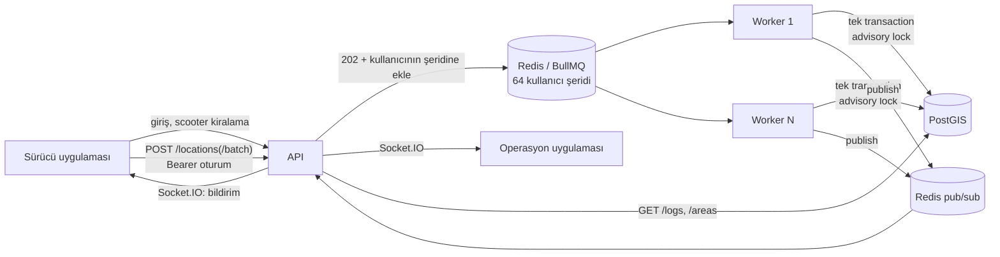

# Location Tracking Service

Mobil uygulamadaki kullanıcıların yaklaşık 5 saniyede bir gönderdiği konumları alır. Konumun tanımlı polygon alanlardan birine girip girmediğini tespit eder ve girişi kaydeder; kullanıcı alandan çıktığında aynı kayda çıkış zamanını da ekler. Trafik artışını karşılayacak şekilde tasarlandı: istekler kuyruğa alınır, ayrı worker süreçleri işler.

Konumu gönderen "kullanıcı" bir scooter'dır ve filoya kayıtlı olmalıdır; kayıtsız kimlikten gelen konum kabul edilmez. Sürücüler kullanıcı adı ve şifreyle üye olup giriş yapar, boştaki bir scooter'ı kiralar; konumlar kiralanan scooter adına gider. 30 saniye konum göndermeyen scooter'ın açık girişleri "sinyal kesildi" olarak kapatılır (bkz. "Sinyal kaybı"); 10 dakika göndermezse kiralaması da biter ve scooter boşa çıkar (bkz. "Sessiz kiralama").

Yanında servisle veri alışverişi yapan iki istemci de var (case kapsamı dışında, demo için):
- **Sürücü uygulaması:** Giriş/üyelik, boştaki scooter'ı seçme (hepsi doluysa "Boşta scooter yok"), sürüş. Gerçek bir cihaz gibi 5 saniyede bir konum gönderir; bir bölgeye girip çıkınca beklemeden gönderir. Çevrimdışıyken konumları biriktirir, bağlanınca toplu yollar.
- **Operasyon uygulaması:** Canlı harita, giriş kayıtları, alan yönetimi (çiz, düzenle, sil) ve filo yönetimi (scooter ekle, sil; kimde, son sinyal).

| | |
|---|---|
| Backend | NestJS 12, TypeScript |
| Veritabanı | PostgreSQL 17 + PostGIS 3.5 |
| ORM | TypeORM 1.x |
| Kuyruk | BullMQ 6 + Redis 8 |
| Canlı yayın | Socket.IO + Redis pub/sub |
| Arayüz | React 19, Vite 8, Leaflet |

## Hızlı başlangıç

```bash
docker compose up -d --build        # postgis, redis, migrate, api, 2 worker, ops, driver
node api/scripts/seed.mjs           # Kadıköy/Moda çevresinde 10 örnek alan (bağımlılık gerektirmez)
```

Migration kurulumda 5 scooter ekler (`scooter-01` … `scooter-05`).

- API ve Swagger: http://localhost:3000/docs. Yerel demo anahtarı: `dev-api-key` (operasyon, betikler, mobil backend). Sürücü uç noktaları için önce `POST /auth/register` ya da `/auth/login`; dönen token Swagger'da "Authorize" → `rider` alanına girilir.
- Operasyon uygulaması: http://localhost:8080
- Sürücü uygulaması: http://localhost:8081. Üye olun, bir scooter seçin ve "Sürüşü başlat" deyin; operasyon uygulamasını yanında açık tutun.
- Sağlık ve kuyruk durumu: http://localhost:3000/health
- Metrikler: http://localhost:3000/metrics (API), worker'larda `:9100/metrics`

> Postgres host'ta **5444**, Redis **6390** portundan açılır. Bu makinede 5432, 5433 ve 6379 başka servislerce kullanılıyordu.

## Mimari



- **API** (`api/src/main.ts`): İsteği doğrular, gönderenin o scooter için yetkisine bakar, konumu kuyruğa ekler ve hemen `202` döner. Konum kabulünde veritabanına gitmez (kayıtlı scooter listesi bellekte, sürücünün kiralaması Redis'te önbellekli), bu yüzden ani yüklerde de hızlı kalır.
- **Worker** (`api/src/worker.ts`): Aynı kod tabanından, HTTP sunucusu olmadan çalışır. `docker compose up --scale worker=N` ile yatayda çoğaltılır. Kuyruk kullanıcılara göre şeritlere bölünmüştür: aynı kullanıcının işleri tek tek, geliş sırasıyla işlenir, farklı şeritler paralel ilerler (bkz. Tasarım kararları). Ayrıca 30 saniyede bir sinyali kesilen scooter'ları tarar.
- **Realtime:** Worker'lar işlenmiş konumu Redis'e yayınlar. Her API instance kendi aboneliğiyle Socket.IO client'larına iletir; bu sayede API birden fazla instance'a çoğaltıldığında da çalışır.

## API

| Endpoint | Açıklama |
|---|---|
| `POST /locations` | `{ userId, lat, lng, timestamp }`. Hepsi zorunlu. `timestamp` ISO 8601, saat dilimi zorunlu (`2026-09-28T10:00:00Z` ya da `+03:00`). Kuyruğa alınır, `202 { jobId, recordedAt }` döner (`jobId` "şerit:iş" biçiminde, ör. `17:123`). |
| `POST /locations/batch` | `{ locations: [...] }`, en fazla 100 konum. Bağlantı koptuğunda biriken konumlar için. Doğrulama hepsi-ya-hiçbiri; `202 { accepted, jobIds }`. |
| `GET /logs` | Alan girişleri, en yeni girişten eskiye. Filtreler: `userId`, `areaId`, `active` (hâlâ içeride mi), `from`/`to` (giriş zamanı aralığı, `timestamp` ile aynı biçim). Sayfalama: `limit`, `cursor`. |
| `POST /areas` | `{ name, type, geometry }`. Geometri GeoJSON Polygon, koordinatlar `[boylam, enlem]`. |
| `GET /areas` | Tanımlı alanlar. Opsiyonel `type` filtresi. |
| `PATCH /areas/:id` | `{ name?, type?, geometry? }`. Geometri değişirse son konumu yeni şeklin dışında kalan scooterların açık girişleri kapanır (`exitReason: AREA_CHANGED`). |
| `DELETE /areas/:id` | Yumuşak silme: alan listede ve konum işlemede yok sayılır, giriş kayıtları kalır; açık girişler kapanır (`exitReason: AREA_REMOVED`). |
| `GET /locations/latest` | Son bilinen konumlar (canlı izleme ekranının ilk yüklemesi için). |
| `GET /scooters` | Filo ve durumları (`AVAILABLE`, `IN_USE`), son sinyal zamanı. Operasyon kimin kullandığını da görür; sürücü sadece kendisinin olup olmadığını. |
| `GET /scooters/:id` | Operasyon için scooter detayı: durum, kimde, son konum, içinde bulunduğu alanlar, son 10 kiralama ve cihaz günlüğü (sunucunun işlediği son konumlar). Filodan çıkarılmış kimlikler için de konumu varsa döner. |
| `POST /scooters` | `{ id, name? }`. Filoya scooter ekler; `id` konumlardaki `userId`'dir. Aynı kimlikle silinmiş scooter geri gelir. |
| `DELETE /scooters/:id` | Scooter'ı filodan çıkarır (yumuşak silme; giriş kayıtları kalır). Kullanımdaysa `409`. |
| `POST /auth/register`, `POST /auth/login` | Sürücü hesabı: `{ username, password }`. `{ token, expiresIn, rider }` döner. |
| `POST /auth/logout`, `GET /auth/me` | Oturumu kapatır; oturumdaki sürücü. |
| `POST /rentals` | `{ scooterId }`: sürücü scooter'ı kiralar. Kullanımdaysa ya da sürücünün zaten bir scooter'ı varsa `409`. |
| `GET /rentals/current`, `POST /rentals/current/end` | Aktif kiralama (sayfa yenilenince sürüşe devam için); sürüşü bitirip scooter'ı bırakma. |
| `GET /health` | DB, Redis ve kuyruk sayaçları. Anahtar istemez. |
| `GET /metrics` | Prometheus metrikleri. Anahtar istemez; dışarıya açılmamalı. |

İki tür kimlik var:
- **API anahtarı** (`x-api-key`): mobil backend, gateway, operasyon paneli, betikler. Her uç noktaya erişir; `/rentals` ve `/auth/me` hariç (bunlar kimin adına yapıldığını bilmek zorunda). Kayıtlı her scooter için konum gönderebilir; park halindeki scooter da konumunu bildirir.
- **Sürücü oturumu** (`Authorization: Bearer <token>`): sadece kendi işleri. Konum gönderir (sadece kiraladığı scooter için), alan ve scooter listesini okur, kiralar ve bırakır. Loglar, alan oluşturma ve filo yönetimi `403`.

Olası hata yanıtları:
- `400`: doğrulama hatası ya da kayıtlı olmayan scooter
- `401`: anahtar ya da oturum eksik veya geçersiz; yanlış kullanıcı adı ya da şifre
- `403`: sürücü oturumu bu uç noktaya yetkili değil ya da scooter bu sürücüye kiralı değil
- `404`: scooter ya da aktif kiralama yok
- `409`: scooter kullanımda, kullanıcı adı alınmış, sürücünün aktif kiralaması yok (konum gönderirken)
- `429`: kullanıcı başına dakikalık konum sınırı ya da başarısız giriş sınırı aşıldı
- `503`: kuyruk dolu

`429` ve `503` yanıtları `Retry-After` başlığıyla gelir; istemci o kadar saniye bekleyip tekrar dener.

Alan tipleri scooter operasyonundan geliyor: `NO_RIDE` (sürüş yasak), `SLOW` (yavaş bölge), `NO_PARKING` (park yasak), `PARKING` (park alanı), `SERVICE` (hizmet bölgesi).

```bash
export H='x-api-key: dev-api-key'
curl -X POST localhost:3000/areas -H "$H" -H 'content-type: application/json' -d '{
  "name": "Moda Sahil", "type": "NO_RIDE",
  "geometry": {"type": "Polygon", "coordinates": [[[29.02,40.98],[29.03,40.98],[29.03,40.99],[29.02,40.99],[29.02,40.98]]]}
}'
curl -X POST localhost:3000/locations -H "$H" -H 'content-type: application/json' \
  -d '{"userId": "scooter-01", "lat": 40.985, "lng": 29.025, "timestamp": "2026-09-26T10:00:00Z"}'
curl -H "$H" 'localhost:3000/logs?userId=scooter-01'
```

`GET /logs` yanıtı:

```json
{
  "data": [
    { "id": "2", "userId": "scooter-01", "areaId": "…", "areaName": "Moda Sahil", "areaType": "NO_RIDE",
      "entryTime": "2026-09-26T10:00:00.000Z", "exitTime": null,
      "exitReason": null, "lastSeenAt": "2026-09-26T10:04:55.120Z" }
  ],
  "nextCursor": null
}
```

- `exitReason`: açık girişte `null`. Kapanmış girişte:
  - `LEFT`: scooter alandan çıktı (alan dışından konum geldi).
  - `SIGNAL_LOST`: konumu 30 saniye gelmediği için kapatıldı, `exitTime` kapatıldığı an (bkz. "Sinyal kaybı"). Gerçek çıkış bundan sonra olabilir.
  - `AREA_CHANGED`: alanın şekli değişti ve scooter'ın son konumu yeni şeklin dışında kaldı.
  - `AREA_REMOVED`: alan silindi.
- `lastSeenAt`: açık girişte servisin scooter'dan son konumu aldığı an. Eskiyse scooter konum göndermiyordur; "içeride" bilinen son durumdur. Kapanmış girişte `null`.

Sürücü akışı:

```bash
TOKEN=$(curl -s -X POST localhost:3000/auth/register -H 'content-type: application/json' \
  -d '{"username": "ali", "password": "guclu-bir-sifre"}' | python3 -c 'import json,sys; print(json.load(sys.stdin)["token"])')
B="authorization: Bearer $TOKEN"
curl -H "$B" localhost:3000/scooters                                   # boştakiler: status AVAILABLE
curl -X POST localhost:3000/rentals -H "$B" -H 'content-type: application/json' -d '{"scooterId": "scooter-02"}'
curl -X POST localhost:3000/locations -H "$B" -H 'content-type: application/json' \
  -d "{\"userId\": \"scooter-02\", \"lat\": 40.985, \"lng\": 29.025, \"timestamp\": \"$(date -u +%Y-%m-%dT%H:%M:%SZ)\"}"
curl -X POST localhost:3000/rentals/current/end -H "$B"
```

## Teknoloji tercihleri

- **PostGIS (PostgreSQL eklentisi):** Nokta-içinde-polygon kontrolü veritabanında, index kullanarak yapılır. Uygulama belleğinde yapmak da mümkündü, ama birden fazla worker'ın alan listesini tutarlı tutması ayrı bir problem olurdu. PostGIS ayrı bir servis değil; primary database yine PostgreSQL.
- **Redis + BullMQ:** Konum trafiği her kullanıcı için 5 saniyede bir, yani aktif kullanıcı sayısıyla doğru orantılı büyür. API isteği kuyruğa atıp hemen döndüğü için veritabanı yavaşlasa ya da ani bir yük gelse de istemciler beklemez. İşleme tarafı API'den bağımsız olarak ölçeklenir. Başarısız işler otomatik olarak tekrar denenir.
- **TypeORM:** PostGIS `geometry` kolonunu doğrudan destekliyor. Prisma'da bu kolon `Unsupported` kalıyor ve coğrafi sorguların hepsi ham SQL'e dönüşüyordu.
- **Socket.IO:** Sadece demo istemcilerindeki canlı bildirim ve izleme için var; servisin temel işleyişi buna bağlı değil (`REALTIME_ENABLED=false` ile kapatılabilir).
- **prom-client:** Prometheus metrikleri için standart Node kütüphanesi. Loglar için ek paket kullanılmadı; NestJS'in kendi logger'ı JSON modunda çalışıyor.

## Varsayımlar

- **Timestamp cihaz saatidir.** Giriş zamanı olarak sunucunun isteği aldığı an değil, konumun ölçüldüğü an kaydedilir. Cihaz saati sunucudan en fazla 60 saniye ileride olabilir.
- **Konumu gelmeyen kullanıcı süresiz "içeride" kalmaz.** 30 saniye konum göndermeyen kullanıcının açık girişleri, kapatıldığı anın saatiyle "sinyal kesildi" olarak kapatılır (bkz. "Sinyal kaybı"). Case çıkışı tanımlamıyor; bu bir genişletme.
- **Eski konumlar atlanır.** Bir kullanıcının son işlenen konumundan daha eski bir konum gelirse, örneğin ağda gecikmişse, durumu geriye götürmesin diye yok sayılır.
- **Alanlar çakışabilir.** Bir konum birden fazla alanın içindeyse her alan için ayrı giriş kaydı açılır.
- **Polygon delikleri desteklenir.** GeoJSON'daki iç halkalar (hole) alanın dışı sayılır. Tam sınır çizgisi üzerindeki nokta içeride sayılmaz (`ST_Contains`); gerçek GPS verisinde bunun pratik bir etkisi yok.
- **`userId` bir scooter kimliğidir ve kayıtlı olmalıdır.** Konumu gönderen cihaz scooter'dır; sürücü değişse de kayıtlar scooter'a göre tutulur (hangi alanda hangi scooter vardı). Kayıtsız kimlikten gelen konum `400` alır. Sürücü uygulaması kimliği gövdede gönderir ama sunucu onu oturumdaki kiralamayla karşılaştırır; güvenilen servis (API anahtarı) kayıtlı her scooter için gönderebilir, park halindeki scooter'ın kendi cihazı gibi.
- **Kiralanmamış scooter da konum gönderebilir.** Gerçek filoda scooter park halindeyken de konumunu bildirir; bu yol sadece API anahtarıyla açık.
- **Scooter durumu elle girilmez.** Boşta ya da kullanımda olması aktif kiralamadan hesaplanır. "Bakımda" gibi elle verilen bir durum şimdilik yok (bkz. kapsam dışı).
- **Unutulan kiralama biter.** 10 dakika (`RENTAL_IDLE_TIMEOUT_MS`) hiç konum gelmeyen kiralama son sinyal anıyla biter, scooter başka sürücülere açılır. Girişleri kapatan 30 saniyeden uzun tutuldu: tünelde ya da kısa bir ağ kopmasında sürücü scooter'ını kaybetmesin.
- **Alanlar az sayıdadır ve seyrek değişir.** Binler mertebesinde olması beklenir, bu yüzden `GET /areas` sayfalanmaz. Log tablosu ise hızla büyüyeceği için sayfalanır.
- **Alan geçmişi silinmez.** Silinen alanın giriş kayıtları denetim ve raporlama için kalır; alan sadece listeden ve konum işlemeden çıkar.
- **ORM kullanımı:** Alan kaydı ve okuma TypeORM repository ile yapılır. Konum işleme ve log sorguları ise performans için TypeORM üzerinden ham SQL ile yazıldı; tek sorguda okuma, CTE ile tek sorguda yazma ve keyset sayfalama ORM sorgu kurucusuyla ifade edilemiyor.

## Tasarım kararları

**Her log kaydı bir giriştir.** Kullanıcı alanın içindeyken gönderdiği konumlar yeni kayıt üretmez; sadece dışarıdan içeri geçiş yeni bir kayıt açar (`entryTime`). Kullanıcı alandan çıktığında aynı kaydın `exitTime`'ı doldurulur. Çıkıp tekrar giren kullanıcı için yeni bir kayıt açılır. `exitTime`'ı boş olan kayıtlar kullanıcının şu an içinde olduğu alanlardır, bu yüzden ayrı bir durum tablosuna gerek yok. `(user_id, area_id) WHERE exit_time IS NULL` üzerindeki unique partial index, aynı alanda iki açık giriş oluşmasını veritabanı seviyesinde de engeller. Giriş zamanı sunucunun saati değil, konumun cihazda ölçüldüğü `timestamp`'tir.

**Coğrafi hesap PostGIS'te yapılır.** Alanlar `geometry(Polygon, 4326)` olarak saklanır ve **GiST index**'lidir. `ST_Contains` sorgusu önce index'teki sınırlayıcı kutularla adayları daraltır. Böylece alan sayısı binlere çıksa da her konum için tüm poligonlar taranmaz. Bir poligonun kendini kesmesi gibi geometrik hatalar `ST_IsValid` ile yakalanır ve `400` döner.

**Eşzamanlılık ve sıra.** Aynı kullanıcının işleri kuyrukta tek tek işlenir (bkz. kullanıcı şeritleri, aşağıda). Veritabanı tarafı yine de buna güvenmez: kilidi düştüğü için başka worker'a verilmiş bir iş, eski worker'da hâlâ sürüyor olabilir. Bir konumun işlenmesi (`api/src/geofence/geofence.service.ts`) tek bir transaction içinde şu adımlardan oluşur:

1. `pg_advisory_xact_lock(hashtextextended(user_id))`: aynı kullanıcının konumları sırayla işlenir, farklı kullanıcılar birbirini beklemez.
2. Konum, kullanıcının son işlenen konumundan eskiyse atlanır. Ağda gecikip geç gelen eski bir konum durumu geriye götürmez.
3. Noktayı içeren alanlar, açık girişler ve son konum zamanı **tek sorguda** okunur.
4. Fark hesaplanır. Yeni girişler, çıkışlar ve son konum **tek bir CTE sorgusuyla** yazılır.

`test/geofence.e2e-spec.ts` testi aynı konumun 50 kopyasını servis seviyesinde paralel işler ve tam 1 giriş beklendiğini doğrular. Kilit kaldırıldığında test kırmızıya düşüyor: 50 kopyanın 20'si ayrı ayrı işlendi ve mükerrer log oluştu. Yani test gerçek bir hatayı yakalıyor.

**Sinyal kaybı.** Giriş, kullanıcının alan dışındaki konumu gelince kapanır. Konum göndermeyi bırakan kullanıcının (uygulama kapandı, pil bitti, sürüş bitti) girişi bu yüzden süresiz açık kalıyor ve kayıtlarda sonsuza dek "İçeride" görünüyordu (dev veritabanında 21 kayıt, hepsinin son konumu 1 saatten eski). İki katmanlı çözüm:
- **Veri:** Worker 5 saniyede bir (`SIGNAL_LOSS_SWEEP_MS`), 30 saniyedir (`SIGNAL_LOSS_TIMEOUT_MS`, 0 kapatır) konumu gelmeyen kullanıcıların açık girişlerini kapatır: `exitTime` girişin kapatıldığı an olur, kayıt `SIGNAL_LOST` olarak işaretlenir ve kullanıcının alanla ilişkisi biter (artık "içeride" sayılmaz). Cihazlar 5 saniyede bir gönderdiği için 30 saniye, art arda 6 konumun gelmemesi demek. Ekranda "sinyal kesildi" diye görünür; olay akışında çıkış sayılmaz.
- **Görüntü:** `GET /logs` açık girişlerde kullanıcının son konumunun alındığı anı (`lastSeenAt`) döner. Operasyon ekranı 15 saniyedir konumu gelmeyen açık girişi (canlı haritada soluklaştığı süre) liste yenilenene kadar "İçeride" yerine "Sinyal yok · 20 sn önce" gösterir.

Tasarım ayrıntıları:
- **Ölçüt "konum göndermemek", "hareket etmemek" değil.** Işıkta bekleyen ya da sürüş sürerken park etmiş scooter konum göndermeye devam eder ve gerçekten içeridedir.
- **Sessizlik sunucu saatiyle ölçülür** (`user_last_location.seen_at`, konum işlenince güncellenir). Cihaz saatiyle (`recorded_at`) ölçülseydi, saati geride olan bir cihaz sürekli konum gönderirken bile sessiz sayılır, girişi her dakika kapanıp yeniden açılırdı.
- **Kuyrukta bekleyen konum sessizlik sayılmaz.** Yük altında konumlar kuyrukta bekleyebilir (yük testinde en fazla ~40 bin iş birikti). Arama, işlenmeyi bekleyen en eski işin yaşı kadar ek pay bırakır: kuyrukta 20 sn bekleyen iş varsa yalnızca 50 sn'den uzun sessiz kalanlar kapanır. Böylece konumu kuyrukta bekleyen aktif kullanıcının girişi kapanıp yeniden açılmaz.
- **Yarış yok.** Her kullanıcı, konum işlemeyle aynı kullanıcı kilidi altında kapatılır ve sessizlik kilit altında yeniden kontrol edilir; tam o sırada işlenen bir konum girişi kapattırmaz. Her worker arar; aynı kullanıcıyı ikinci kez kapatacak açık giriş kalmaz. Aramalar 500 kullanıcılık gruplarla, kullanıcı başına kısa transaction'larla yapılır.
- **Bedeli:** Sürüş sadece park alanında bitebiliyor ve bitince uygulama konum göndermeyi bırakıyor; park edilen scooter 30 saniye sonra "sinyal kesildi" olarak kapanır (kayıt bunu "çıktı" değil "sinyal kesildi" diye söyler). Scooter yeniden konum gönderirse yeni bir giriş açılır. Sürücü uygulaması 30 saniyeden uzun çevrimdışı kalıp birikmiş konumlarını sonra gönderirse, bu konumlar yeni bir giriş açar ve girişin zamanı (cihazda ölçüldüğü an) önceki kaydın çıkış zamanından (kapatıldığı an) önce olabilir. Çıkış zamanı cihaz saatiyle ileride olan girişten önce yazılmaz.
- **Canlı yayın bağlantıları ayrı konu.** Ping'e 30 saniye cevap vermeyen Socket.IO bağlantısı zaten kapatılıyor (bkz. Güvenlik); ama konumlar HTTP ile geldiği için bu "içeride" durumunu etkilemez.

**İleri tarihli konumlar reddedilir.** `timestamp` sunucu saatinden 60 saniyeden fazla ilerideyse istek `400` alır. Aksi halde bu konum, sonraki gerçek konumların "eski" sayılıp atlanmasına yol açardı.

**Loglarda keyset sayfalama.** `GET /logs` OFFSET yerine `(entry_time, id)` cursor'ı kullanır. Log tablosu trafikle birlikte hızla büyüyeceği için bu önemli: sayfa derinleştikçe sorgu yavaşlamaz ve `(user_id | area_id, entry_time DESC, id DESC)` index'lerini doğrudan kullanır.

**Ayarlar açılışta doğrulanır.** Ortam değişkenleri servis ayağa kalkmadan kontrol edilir. Verilmeyen değer için varsayılan kullanılır. Verilen ama geçersiz bir değer (ör. `DB_PORT=abc`, `REDIS_URL=http://...`, hatalı `CORS_ORIGINS`) sessizce varsayılana düşmez: servis bütün sorunları birlikte listeleyip 1 koduyla çıkar. Production'da API sunucusu `API_KEYS` olmadan ve 16 karakterden kısa bir anahtarla açılmaz. Worker, migration ve smoke betikleri anahtar kullanmadığı için bu kural onlara uygulanmaz.

**Kuyruk ayarları.** Tamamlanan işler Redis'te birikmez: incelemek için tamamlananların son ~1.000'i, başarısızların son ~5.000'i tutulur (`QUEUE_KEEP_COMPLETED`, `QUEUE_KEEP_FAILED`). BullMQ bu sınırları kuyruk başına uyguladığı için şeritlere bölünür; bölünmeseydi 64 şerit 64 kat iş biriktirirdi (yük testinden sonra 64 bin iş, 84 MB). Yeniden deneme ve eşzamanlılık şerit tasarımının parçası (aşağıda).

**Toplu istekte sıra korunur.** Toplu istekteki konumlar kullanıcı başına tek işte, zamana göre sıralı tutulur ve worker bunları sırayla işler. Ayrı işler olsalardı paralel worker'lar yeni noktayı eskiden önce işleyebilirdi. O zaman eski nokta "geç gelmiş" sayılıp atlanır ve bir alan girişi kaçabilirdi; e2e testi bu durumu ters sırada gönderilen noktalarla doğruluyor.

**Aynı kullanıcının ayrı istekleri de sırayla işlenir: kullanıcı şeritleri.** Uzun bir kopukluktan sonra cihaz birikmiş konumları 100'lük istekler halinde art arda gönderir. Her istek ayrı bir iştir. Paralel worker'lar sonrakini öncekinden önce işlerse öncekinin noktaları "eski" sayılıp atlanır ve aradaki girişler/çıkışlar kaybolur. Bu yüzden kuyruk şeritlere bölündü (`QUEUE_LANES`, varsayılan 64; `api/src/queue/location-lanes.ts`):

- Her kullanıcı `userId`'nin hash'iyle (FNV-1a) hep aynı şeride düşer.
- Şeritte aynı anda tek iş çalışır. Bu sınır BullMQ'nun kuyruk düzeyindeki global concurrency ayarıyla Redis'te uygulanır; worker süreci sayısından bağımsızdır.
- Farklı şeritler paralel ilerler: aynı anda en fazla 64 iş işlenir, önceki 2 worker × 32 ayarıyla aynı paralellik.
- Bedeli: yavaş bir iş aynı şeritteki diğer kullanıcıları (yaklaşık 1/64'ünü) bekletir. En dolu şeridin derinliği ayrı bir metrik olarak yayınlanır (`location_lane_backlog_max`).
- Yeniden deneme işin içinde yapılır; BullMQ'nun kendi yeniden denemesi işi şeridin sonuna atar ve sonraki iş öne geçerdi. Bekleme 200 ms'den başlayıp ikiye katlanır, en fazla 5 sn olur.
  - **Geçici altyapı hatası** (veritabanı kapalı, yeniden başlıyor, bağlantı koptu, zaman aşımı): 5 dakika boyunca denenir (`WORKER_TRANSIENT_RETRY_MS`). İş şeridinde sırasını koruyarak bekler, veritabanı dönünce kaldığı yerden devam eder.
  - **Kalıcı hata** (veri ya da kod hatası): 3 denemeden sonra iş başarısız sayılır ve şerit sıradaki işle devam eder; tekrar denemek düzeltmez, şerit tıkanmasın (`WORKER_POINT_ATTEMPTS`).
  - Önceden her hata ~0,6 sn sonra bırakılıyordu. Canlı ölçüm: konumlar sürekli gönderilirken Postgres 3 sn kapatıldı. API 333 konumun hepsini kabul etti ama worker'lar 48'ini işleyemeden kaybetti. Düzeltmeden sonra aynı denemede kayıp sıfır; kesinti boyunca worker başına tek satır uyarı loglandı.
- Şerit sayısı API ve worker'da aynı olmalı. İlk açılan süreç sayıyı Redis'e yazar (`<önek>:lanes`); farklı sayıyla açılan worker açılmayı reddeder, API hatayı loglar. Değiştirmek için API durdurulur, kuyruk boşalınca bu anahtar silinir ve tüm süreçler yeni değerle açılır.
- Şeritlerden önceki tek kuyrukta güncelleme sırasında kalmış işler de worker tarafından işlenir.

`test/lanes.e2e-spec.ts` iki worker'ı aynı şeride bağlar ve işlerin hiç üst üste binmediğini, geliş sırasıyla işlendiğini doğrular. Global sınır kaldırıldığında test kırmızıya düşüyor.

Önceki tasarım tek kuyruk ve kullanıcı başına sıra numarasıyla çalışıyordu: sırası gelmemiş iş erteleniyor, önceki bitince öne alınıyordu. İnceleme iki sorun buldu. Öne alınan iş aslında kuyruğun sonuna düşüyordu ve 30 saniyelik "takıldı" kuralı yavaş ama çalışan işi de geçiyordu. Yük testinde işleme hızı da yarıya inmişti (bkz. Performans).

**Kapanış (deploy, ölçek küçültme) istek kaybettirmez.** Kapanış başlayınca yeni isteklere `503` döner; istemci ve load balancer tekrar dener. Kapanıştan önce gelmiş istekler bitene kadar Redis bağlantıları ve kuyruklar açık kalır; hepsi HTTP sunucusu kapandıktan sonra kapanır. Redis erişilemezse bağlantılar beklemeden kesilir, kapanış asılı kalmaz. Önceden bağlantılar HTTP sunucusundan önce kapanıyor, o anda işlenen konumlar `500` alıyordu; e2e testi kapanış sırasında sürekli istek göndererek bunu doğrular.

**Açılışta Redis yoksa API yine ayağa kalkar.** `/logs`, `/areas` ve `503` dönen `/health` çalışır; canlı yayın aboneliği Redis gelince kendiliğinden kurulur.

**Çöken worker'ın işi başkasına geçer.** Worker işin kilidini 10 saniyede bir yeniler. Süreç çöker ya da Redis'e ulaşamazsa kilit 20 saniye içinde düşer. Diğer worker'lar 5 saniyede bir kilidi düşmüş iş arar ve bulduğunu şeridin önüne geri koyar. Böylece şerit en fazla ~30 saniye bekler ve sıra bozulmaz: iş baştan işlenir, önceden işlenmiş noktaları "eski" sayılıp atlanır (`WORKER_LOCK_MS`, `WORKER_STALLED_CHECK_MS`). e2e testi takılan worker'ı kapatır; işin sırası bozulmadan diğer worker'da bittiğini doğrular.

Bir iş başarısız sayılmadan önce 3 kez takılabilir (`WORKER_MAX_STALLED_COUNT`; BullMQ'nun varsayılanı 1). Makine bellek sıkıntısında 20 sn'den uzun donduğunda işler iki kez takılıp başarısız sayılıyor, konumlar kayboluyordu (yük testinde 60 iş). Sürekli worker'ı çökerten bir iş ise yine sonunda bırakılır. Kapanışta çalışan işin bitmesi en fazla 8 sn beklenir (`WORKER_SHUTDOWN_GRACE_MS`): veritabanı kapalıyken iş dakikalarca bekleyebileceği için beklemeden kapanılır, işin kilidi düşünce başka worker devralır.

**Kuyruk dolarsa yük reddedilir (backpressure).** Worker'lar uzun süre yetişemezse kuyruk sınırsız büyüyüp Redis belleğini doldururdu. Tüm şeritlerde bekleyen iş sayısı `QUEUE_MAX_BACKLOG`'u (varsayılan 200.000) aşınca API yeni konumları `503 Retry-After: 5` ile reddeder. Kuyruk derinliği her istekte sorulmaz; saniyede bir arka planda okunur, böylece sıcak yola ek bir Redis çağrısı eklenmez.

### Scooterlar, sürücü hesapları ve kiralama

**Neden.** İlk sürümde her kimlik kabul ediliyordu ve sürücü uygulaması rastgele bir scooter kimliği üretiyordu; bir anahtarı bilen herkes başka bir kimlik adına konum gönderebiliyordu. Gerçek bir ürün için filo bilinmeli, sürücü kim olduğunu kanıtlamalı ve bir scooter aynı anda tek kişide olmalı.

**Veri modeli** (migration `FleetAndRiders`):
- `scooters`: `id` (konumlardaki `userId`), `name`, `deleted_at`. Kurulumda 5 scooter gelir. Silme yumuşaktır: silinen scooter konum gönderemez ve kiralanamaz, ama giriş kayıtları ve kiralama geçmişi kalır; aynı kimlikle tekrar eklenince geri gelir.
- `riders`: `username` (küçük harfle, benzersiz), `password_hash` (Argon2id).
- `rentals`: `scooter_id`, `rider_id`, `started_at`, `ended_at`, `end_reason` (`RETURNED` ya da `SIGNAL_LOST`). İki kısmi unique index: bir scooter'ın ve bir sürücünün en fazla bir açık kiralaması olabilir. İki sürücü aynı scooter'a aynı anda basarsa veritabanı birini reddeder (`409`); e2e testi 5 sürücüyü aynı scooter'a aynı anda gönderir ve sadece birinin aldığını doğrular.
- `area_logs.exit_reason`: alan dışından konum gelmeden kapanan girişin sebebi (`SIGNAL_LOST`, `AREA_CHANGED`, `AREA_REMOVED`); normal çıkışta `NULL`, API'de `LEFT`. Sinyal kaybı ilk olarak ayrı bir `signal_lost` kolonuyla geldi; migration `UnifyExitReason` işaretli kayıtları bu kolona taşıyıp eskisini kaldırır, böylece çıkış sebebi tek yerde tutulur.
- Kiralama ile silme yarışmaz: kiralama scooter satırını `FOR SHARE`, silme `FOR UPDATE` ile kilitler. Silme kiralamadan önce biterse kiralama scooter'ı silinmiş bulur (`404`), sonra biterse kiralamayı görür (`409`).

**Konum kabulü veritabanına gitmez.** Kayıtlı scooter listesi her API instance'ının belleğindedir (`ScooterRegistry`): açılışta yüklenir, scooter eklenince ya da silinince Redis üzerinden duyuruyla (`<önek>:fleet`) tüm instance'larda yenilenir, duyuru kaçarsa dakikada bir. Veritabanı sonradan erişilemezse bilinen son liste kullanılır; açılışta hiç yüklenemediyse konumlar `503` alır (kayıtsız kimlik kabul etmektense beklemek). Sürücünün kiraladığı scooter Redis'te 30 sn önbelleklidir; kiralama başlarken ve biterken hemen güncellenir. Böylece API'nin "konumu veritabanına dokunmadan kabul et" özelliği korunur.

**Sessiz kiralama.** Worker, 10 dakikadır (`RENTAL_IDLE_TIMEOUT_MS`, 0 kapatır) konum göndermeyen kiralanmış scooter'ları arar (`api/src/fleet/idle-rental.sweeper.ts`, giriş kayıtlarının sinyal kaybı taramasıyla aynı aralıkta):
- Aktif kiralama son sinyal anıyla (hiç konum yoksa başlangıç anıyla) `SIGNAL_LOST` sebebiyle biter; scooter başka sürücülere açılır. Sürüşü bitirmeden uygulamayı kapatan sürücü scooter'ı kilitli bırakamaz.
- Sessizlik giriş kayıtlarındaki gibi sunucu saatiyle (`seen_at`) ölçülür ve kuyrukta bekleyen en eski işin yaşı kadar pay bırakılır. Tek `UPDATE ... WHERE ended_at IS NULL` ile bittiği için iki worker aynı kiralamayı iki kez bitiremez.
- Kiralama önbelleği silinir ve filo duyurusu gider: sürücünün sonraki konumları `409` alır, uygulama kiralamanın bittiğini söyleyip seçim ekranına döner; operasyon ekranındaki filo listesi yenilenir.

**Alan düzenleme ve silme.** Giriş kayıtları hep bir konumdan doğar; alan değişince kayıtların tutarlı kalması için (migration `AreaEdits`, `api/src/areas/areas.service.ts`):
- **Ad ya da tip değişince** kayıtlara dokunulmaz: kayıtlar alana okunurken bağlanır, eski girişler de yeni adla görünür.
- **Şekil değişince** sadece son konumu yeni şeklin dışında kalan scooterların açık girişleri kapanır (`AREA_CHANGED`); içeride kalanların ziyareti bölünmez. Şekil genişleyip bir scooter'ı içine alırsa giriş, o scooter'ın sonraki konumuyla açılır: giriş zamanı hep cihazdan gelen konumdur, alanın düzenlendiği an değil.
- **Silme yumuşaktır** (`deleted_at`): alan listede ve konum işlemede yok sayılır, açık girişler kapanır (`AREA_REMOVED`), geçmiş kayıtlar alanın adıyla kalır. Gerçek silme `area_logs` yabancı anahtarının `ON DELETE CASCADE`'i yüzünden geçmişi de silerdi.
- Kapanan girişlerin çıkış zamanı değişikliğin anıdır (sunucu saati); cihaz saati biraz ileride olabildiği için girişten önceye düşmez. Kapanışlar tek transaction'da yapılır, çıkış olayları canlı yayına gider, alan listesi tüm istemcilere duyurulur (`areas-changed`).
- Değişiklikle aynı anda işlenen bir konum eski şekle göre giriş açabilir (worker alanı kilitlemez; sıcak yola kilit eklememek için). Durum kendini düzeltir: scooter'ın sonraki konumu yeni şeklin dışındaysa normal çıkış yazılır, hiç konum gelmezse sinyal kaybı taraması kapatır.

**Sunucu tarafı cihaz günlüğü.** Operasyon bir scooter'ın son dakikalarda ne gönderdiğini ve sunucunun ne yaptığını görebilsin diye worker, işlediği her konumu scooter başına Redis'te bir listeye yazar (`api/src/fleet/device-log.ts`): API'ye ulaştığı an, işlendiği an, cihaz saati, konum, sonuç (işlendi ya da daha yeni bir konum işlenmiş olduğu için atlandı), girilen ve çıkılan alanlar, istek kimliği.
- Liste sınırlı ve süreli: scooter başına son 50 konum (`DEVICE_LOG_SIZE`, 5 sn'lik gönderimde ~4 dakika), son konumdan 24 saat sonra silinir (`DEVICE_LOG_TTL_HOURS`). 5.000 aktif scooter yaklaşık 40 MB tutar.
- Konum geçmişi veritabanına yazılmaz (veri modeli bilinçli olarak sadece girişleri ve son konumu saklar); bu kayıt kalıcı değil, kısa süreli bir teşhis aracıdır.
- Worker iş başına tek Redis isteği atar (iş toplu konum da taşısa); yazılamazsa konum işleme etkilenmez, günlükte boşluk kalır. API'nin reddettiği istekler (kayıtsız scooter, kiralama yok, rate limit) worker'a ulaşmadığı için günlükte görünmez; onlar API loglarında istek kimliğiyle bulunur.
- Kiralama geçmişi için `rentals (scooter_id, started_at DESC)` index'i eklendi (migration `RentalHistoryIndex`, `CONCURRENTLY`).

**Sürücü uygulamasında bırakma.** "Sürüşü bitir" (sadece park alanında) önce bekleyen konumları gönderir (bağlantı kesikse açar, en fazla 10 sn bekler), sonra kiralamayı bitirir. Çevrimdışı biriken konumlar scooter bırakılmadan kaybolmaz; tarayıcı testi istek sırasını doğrular.

**nginx, API'yi istek anında çözer.** Demo istemcilerinin nginx'i API adresini Docker DNS'inden en fazla 10 sn önbellekle çözer. Önceden adres açılışta bir kez çözülüyordu: API container'ı yeniden oluşturulunca (deploy) iki arayüz nginx yeniden başlatılana kadar `502` alıyordu (bu çalışma sırasında görüldü).

## Veritabanı

Tasarım kararları, 3 milyon giriş kaydı ve 50 bin kullanıcılı ayrı bir bench veritabanında ölçülerek verildi. Aynı ölçümler `./loadtest/db-bench/run.sh` ile tekrarlanabilir.

**Okuma sorguları ölçekleniyor.** 3 milyon kayıtta `GET /logs`'un bütün filtre çeşitleri, derin sayfalar ve worker'ın konum başına okuması 2 ms'nin altında. Hepsi uygun index'i kullanıyor ve keyset sayfalama sayesinde sayfa derinliği hızı etkilemiyor.

**Açık girişler için kısmi index.** "Hâlâ içeride" filtresiyle listenin sonuna gelindiğinde veritabanı tüm tabloyu tarıyordu (2,27 sn). Sadece açık girişleri kapsayan index (`WHERE exit_time IS NULL`, 544 KB) bunu 0,04 ms'ye indirdi.

**Son konum güncellemeleri HOT.** `user_last_location` her konumda güncellenir. `recorded_at` üzerindeki index bu güncellemelerin index'e dokunmadan yapılmasını (HOT) engelliyordu: HOT oranı %0'dı ve tablo 30 saniyelik yükte 5 MB'tan 15 MB'a şişiyordu. Index kaldırıldı ve sayfalarda güncelleme payı bırakıldı (`fillfactor=70`); HOT oranı %100 oldu, şişme durdu ve worker transaction'ı %6,5 hızlandı. Bu index'i kullanan tek sorgu (`GET /locations/latest`) artık tabloyu tarıyor ve sadece operasyon ekranı açılırken çalışıyor. Sorgu önce en yeni kullanıcıları seçer, içinde oldukları alanları yalnızca onlar için okur (önceden penceredeki bütün kullanıcıları birleştirip gruplayıp sonra kesiyordu). 50 bin kullanıcı ve 1 milyon giriş kaydında (30 dk, limit 1000) 40 ms'den 9 ms'ye indi. Operasyon ekranının kullandığı 1 dakikalık pencerede iki sürüm de ~3 ms; sonuçlar birebir aynı (aynı saniyedeki kullanıcılar arasında sıra artık kimliğe göre belirli). `fillfactor` yeni sayfalara uygulanır: var olan bir kurulumda etkisi için tablo bir kez `VACUUM FULL user_last_location` ile yeniden yazılmalı. Migration bunu kilit tutmamak için kendisi yapmaz.

**Giriş kayıtlarında temizlik eşikleri.** `area_logs`'ta her çıkış bir satırı günceller. `exit_time` kısmi index'lerin koşulunda geçtiği için bu güncelleme HOT olamaz: ölü satır bırakır ve bütün index'lere yeni kayıt ekler. Varsayılan eşikle (%20) 100 milyon kayıtta otomatik temizlik ancak 20 milyon çıkıştan sonra başlardı. Temizlik, eklemeyle tetiklenen temizlik ve istatistik eşikleri %2'ye çekildi; tablo büyüdükçe seyrekleşmezler. Etkisi bu ortamda ölçülmedi (büyük ve uzun süre yazılan bir tablo gerekir).

**Dayanıklılık: giriş kayıtları kaybolmaz.** `synchronous_commit` varsayılan (açık) ayarında. Giriş veya çıkış üretmeyen konumlarda, ki bunlar konumların çoğu, uygulama transaction içinde `SET LOCAL synchronous_commit = off` kullanır. Bir çökmede kaybolabilecek tek şey son konumdur ve bir sonraki konumla (5 sn) zaten yenilenir. Giriş kayıtları her zaman diske yazılarak onaylanır. Redis kuyruğu da diske yazılır (AOF, saniyede bir).

| Mod (worker transaction'ı, pgbench, 8 istemci) | Saniyede transaction | Giriş kayıtları çökmede |
|---|---|---|
| Tamamen dayanıklı | 4.883 | korunur |
| **Karma (uygulamadaki)** | **5.810** | **korunur** |
| Tamamen kapalı (önceki ayar) | 6.008 | kaybolabilir |

**Zaman aşımları.** Her bağlantı `statement_timeout` (varsayılan 5 sn, `DB_STATEMENT_TIMEOUT_MS`) ve `idle_in_transaction_session_timeout` (varsayılan 30 sn, `DB_IDLE_TX_TIMEOUT_MS`) ile açılır. Takılan bir sorgu ya da açık bırakılmış bir transaction bağlantıyı ve kilitleri süresiz tutamaz. Migration'larda sorgu süresi sınırı yok.

**Migration kilitleri.** Migration bağlantısı `lock_timeout` ile açılır (varsayılan 5 sn, `DB_MIGRATION_LOCK_TIMEOUT_MS`): tabloda uzun süren bir işlem (ör. VACUUM, açık bir transaction) varsa deploy süresiz beklemez, hata verip durur ve tekrar denenebilir. Postgres'te kilit bekleyen bir `ALTER TABLE` arkasına gelen sorguları da bekletir; bu yüzden sınır önemli. Sınır bağlantı düzeyinde olduğu için transaction'lı ya da transaction'sız (`CONCURRENTLY`), ileri ya da geri her migration'a kendiliğinden uygulanır; migration dosyalarında `SET LOCAL` gerekmez (transaction dışında zaten etkisizdir). `CREATE INDEX CONCURRENTLY` de eski transaction'ların bitmesini beklerken bu sınıra takılabilir; o durumda kalan INVALID index, migration tekrar çalışınca yeniden oluşturulur.

**Index'leri kilitlemeden oluşturma.** Yeni index'ler `CREATE INDEX CONCURRENTLY` ile eklenir; büyük tabloda yazmalar durmaz. Bu yüzden ilgili migration transaction dışında çalışır.

**Büyüme.** 1 milyon giriş kaydı index'lerle birlikte yaklaşık 255 MB tutar. Index'ler tablonun kendisinden büyük, çünkü üç farklı sıralama (zaman, kullanıcı, alan) keyset sayfalamayla destekleniyor. Saklama politikası şimdilik yok; bkz. "Bilinçli olarak kapsam dışı bırakılanlar".

## Güvenlik

- **API anahtarı:** Servisin mobil uygulamanın backend'i veya bir API gateway tarafından çağrıldığı varsayıldı. İstemciler `x-api-key` ile doğrulanır. Anahtarlar sabit süreli karşılaştırılır, böylece karakter karakter tahmin edilemez. `API_KEYS` virgülle ayrılmış birden fazla anahtar alır, bu da anahtar değiştirirken eskisini kısa süre geçerli tutmayı sağlar. Tanımlı değilse doğrulama kapalıdır ve açılışta uyarı loglanır. Canlı yayın bağlantısı da aynı anahtarı el sıkışmada ister. Production'da 16 karakterden kısa anahtar kabul edilmez; bu, `dev-api-key` gibi herkesin bildiği demo anahtarlarını engeller.
- **Sürücü hesapları:** Sürücüler kullanıcı adı ve şifreyle üye olur ve giriş yapar; herkese açık istemcide paylaşılan bir anahtar yoktur. Önceki "sadece konum gönderebilen sürücü anahtarı" (`INGEST_API_KEYS`) kaldırıldı: nginx'in eklediği anahtarı herkes kullanabiliyor ve istediği `userId` adına konum gönderebiliyordu. Eski ayar verilirse API açılmaz ve ne yapılacağını söyler.
  - **Şifreler** Argon2id ile tuzlanıp özetlenir (Node 24'ün `crypto` modülü, ek paket yok); OWASP'ın şifre saklama için ilk önerisi, parametreler de OWASP'ın verdiği ilk seçenek: 19 MiB bellek, 2 tur, 1 iş parçacığı (bu ortamda bir özet ~15 ms). Özet standart PHC biçiminde (`$argon2id$v=19$m=19456,t=2,p=1$tuz$özet`), parametreleri taşır: ileride artırılırsa eski özetler yine doğrulanır ve sürücü giriş yapınca yenilenir. İlk sürüm scrypt (N=2^14) kullanıyordu; bu OWASP'ın scrypt için verdiği asgari değerin (N=2^17) altındaydı. O özetler hâlâ doğrulanır ve girişte Argon2id'ye yenilenir. Kullanıcı adı yoksa da sahte bir özet karşılaştırılır: yanıt süresi ve mesajı ("Kullanıcı adı ya da şifre yanlış") hangi adların kayıtlı olduğunu söylemez.
  - **Oturum** rastgele 256 bit bir token'dır; Redis'te token'ın kendisi değil SHA-256 özeti anahtar olarak, süreli (`RIDER_SESSION_TTL_HOURS`, varsayılan 24) tutulur. Çıkışta hemen silinir. JWT yerine opak token seçildi: çıkış anında geçerli olur, imza anahtarı yönetimi gerekmez; bedeli istek başına bir Redis okuması.
  - **Kaba kuvvet:** kullanıcı adı başına 15 dakikada 10 başarısız giriş (`LOGIN_MAX_ATTEMPTS`); fazlası doğru şifreyle de `429` alır, başarılı giriş sayacı sıfırlar. IP'ye göre değil: saldırgan IP değiştirerek aynı hesabı denemeye devam edemez. Bedeli, birinin bir hesabı bilerek 15 dakika kilitleyebilmesi.
  - **Sürücü sadece kendi scooter'ı adına:** konum gövdedeki kimlik oturumdaki kiralamayla karşılaştırılır; kiralama yoksa `409`, başka scooter için `403`. Canlı yayında da sadece kiraladığı scooter'ın odasına abone olabilir ve aynı anda tek odada durur. Tüm filonun yayını (`monitor`, `events`) API anahtarı ister.
  - Sürücü oturumu loglara, alan oluşturmaya, filo yönetimine ve son konumlara erişemez (`403`). `/rentals` ve `/auth/me` ise sadece sürücü oturumuyla çalışır: kimin adına yapıldığı belli olmalı.
- **Ölü bağlantılar kapatılır:** Sunucu her canlı yayın bağlantısına 10 saniyede bir ping gönderir; 20 saniye içinde cevap vermeyen bağlantı kapatılır. Uygulaması kapanmış ya da ağı kopmuş cihazların bağlantıları en geç 30 saniyede temizlenir, bellekte ve oda listelerinde birikmez (`REALTIME_PING_INTERVAL_MS`, `REALTIME_PING_TIMEOUT_MS`).
- **Rate limit (kullanıcı başına):** Varsayılan dakikada 60 konum. 5 saniyede bir gönderen cihaz dakikada 12 istek atar, yani 5 kat pay var. Sınır IP'ye göre değil kullanıcıya göre uygulanır, çünkü mobil kullanıcılar operatör NAT'ı arkasında aynı IP'yi paylaşabilir. Sayaç Redis'te tutulduğu için birden fazla API instance'ı arasında ortaktır. Kontrol ve artırma tek bir Lua betiğinde atomik yapılır. Sayacı sınırın altında olan kullanıcının isteği, sınırı tek başına aşsa bile kabul edilir; aksi halde uzun kopukluktan sonra gelen 100 konumluk toplu istek, 60'lık sınırla hiç geçemez ve cihazın kuyruğu kalıcı olarak tıkanırdı. Bu yüzden bir kullanıcı dakikada en fazla 60 - 1 + 100 konum gönderebilir. Reddedilen istek kotadan düşmez. IP bazlı genel koruma API gateway veya load balancer katmanının işidir.
- **CORS:** Production'da varsayılan olarak kapalıdır; `CORS_ORIGINS` ile izin verilen adresler açıkça verilir. Demo istemcileri nginx üzerinden aynı adresten sunulduğu için CORS'a ihtiyaç duymaz.
- **Demo istemcilerinin anahtarı:** Operasyon uygulamasının anahtarını nginx ekler; tarayıcı kodunda görünmez. Ama bu, anahtarı saklamak anlamına gelmez: o nginx'e erişebilen herkes anahtarın yetkisiyle istek atabilir. Bu yüzden tam yetkili operasyon uygulaması production'da iç ağda, VPN'de ya da SSO arkasında yayınlanmalıdır. Herkese açık sürücü uygulamasının nginx'i anahtar eklemez; sürücü kendi oturumuyla gelir.
- **Demo ortamı production değil:** `docker compose` demo için `NODE_ENV=development` ve herkesin bildiği anahtarla çalışır. JSON log ve kapalı CORS gibi production davranışları ise compose'ta açıkça seçildi. Gerçek ortamda `NODE_ENV=production` ve `API_KEY` secret olarak verilir; kısa anahtarla API açılmaz.
- **Veritabanında en az yetki:** API ve worker, sadece yaptıkları işlere yetkili bir rolle bağlanır: `areas`, `area_logs`, `user_last_location`, `scooters` ve `rentals` için okuma, ekleme ve güncelleme (alan ve scooter silme yumuşaktır, bir güncellemedir); `riders` için okuma, ekleme ve sadece şifre özeti kolonunu güncelleme (girişte eski özet yenilenir). Kullanıcı adı değiştirme, alan, hesap, scooter ya da kiralama geçmişi silme, tablo boşaltma, şema değiştirme ve sunucuda komut çalıştırma (`COPY ... TO PROGRAM`) yetkisi yoktur. Rolü migrate betiği, şema sahibiyle çalışırken her seferinde oluşturur ya da günceller (`DB_APP_USER`, `DB_APP_PASSWORD`; `api/src/database/app-role.ts`). Şifre sunucuya düz metin değil, `psql`'in `\password` komutu gibi SCRAM-SHA-256 doğrulayıcısı olarak gönderilir: `ALTER ROLE ... PASSWORD` metni `pg_stat_statements`'a ve sunucu loglarına düşebilir. (İlk `pg_stat_statements` sürümünde şifre orada açık metin görünüyordu; kod incelemesi buldu, canlıda doğrulandı.) Şema sahibi superuser'dır ve sadece migrate'te kullanılır. Veritabanı testi, uygulamanın gerçek yazma yolunu bu rolle çalıştırır ve yasak işlemlerin reddedildiğini doğrular.
- **Girdi doğrulama sınırları:** Zaman damgası saat dilimli olmalı ve var olan bir güne işaret etmeli; JS ile Postgres'in farklı yorumlayabileceği biçimler (`2024`, `2026-W39-1`, `20260928T100000Z`, `2026-02-30`) `400` alır. Önceden bunlar doğrulamadan geçip `500` veriyordu; sürücü uygulaması `5xx`'te tekrar denediği için tek bir böyle nokta cihazın kuyruğunu tıkayabilirdi. Sayfalama imlecindeki zaman ve kimlik de Postgres'e gitmeden doğrulanır.
- `x-powered-by` başlığı kapalı; doğrulamada tanımsız alan içeren istekler reddedilir. JSON gövde sınırı 512 KB (10 bin köşeli polygon ~220 KB tutar).

## Gözlemlenebilirlik

- **Metrikler (Prometheus):**
  - API'de: HTTP istek süresi (rota şablonu, method, durum kodu), kabul edilen ve reddedilen konumlar (`reason`: rate_limited / backpressure), kuyruk derinliği (tüm şeritler) ve en dolu şeridin derinliği.
  - Worker'da: işleme süresi, kuyrukta bekleme süresi (`location_job_lag_seconds`), alan giriş ve çıkış sayıları, sinyali kesildiği için kapatılan girişler (`area_visits_signal_lost_total`), sessiz kaldığı için biten kiralamalar (`rentals_ended_idle_total`), denemeleri tükenen işler. Birden çok scooter'ın aynı anda sinyal kaybetmesi (ör. hücresel kesinti) bu metriklerde sıçrama olarak görünür.
  - Her ikisinde de Node süreç metrikleri.
  - Worker'ın HTTP API'si olmadığı için metrikleri ayrı bir portta (`WORKER_METRICS_PORT`, varsayılan 9100) yayınlanır.
- **Sorgu istatistikleri:** `pg_stat_statements` açık (compose'da `shared_preload_libraries`, eklentiyi migration kurar). Yük testinden sonra hangi sorgunun toplamda ne kadar zaman harcadığı `SELECT calls, total_exec_time, query FROM pg_stat_statements ORDER BY total_exec_time DESC LIMIT 10` ile görülür. Eklenti "trusted" olmadığı için yönetilen bir veritabanında migration kullanıcısı superuser değilse bu adım atlanır; orada sağlayıcının ayarından açılır.
- **Loglar:** Production'da tek satır JSON; log toplayıcılar doğrudan ayrıştırabilir. Seviye `LOG_LEVEL` ile, format `LOG_FORMAT=json|pretty` ile ayarlanır. Her istek için erişim logu `verbose` seviyesindedir ve varsayılan olarak kapalıdır, yük altında log hacmi patlamasın diye.
- **İstek kimliği:** Gelen `x-request-id` korunur, yoksa üretilir ve yanıtta döner. Kimlik işle birlikte kuyruğa gider; worker'daki hata logları aynı kimliği taşır, böylece bir istek API'den worker'a kadar izlenebilir. API'de beklenmeyen hatalar (`500`) da istek kimliği, method ve yolla tek satır loglanır; yanıt gövdesinde de kimlik döner.
- **Redis kesintisinde loglar:** Bağlantı hataları tek satır uyarı olarak loglanır ve 10 saniyede bire seyreltilir (aradaki tekrarlar sayılır). Önceden her yeniden bağlanma denemesi JSON dışı, çok satırlı yığın izi basıyordu.

## Performans

`loadtest/run.sh` k6'yı (sürümü sabit, 2.3.0) compose ağı içinde çalıştırır: 5.000 farklı scooter, 10 saniyelik ısınmadan sonra 70 saniyede 2.000 istek/sn'ye çıkan yük. Gecikme eşikleri yalnızca tepe senaryosunda ölçülür; ısınma (bağlantı havuzları, JIT) eşiklere girmez. Başlamadan önce tek bir istek atılır; adres ya da anahtar yanlışsa binlerce hata yerine hemen durur. İstekler 5 saniyede zaman aşımına uğrar.

- **Hareket (`MOVE`):** `route` (varsayılan) her scooter'ı kendi yolunda ortalama ~19 km/sa ilerletir ve scooter'lar sırayla gönderir; gerçek bir filo gibi. `teleport` her istekte rastgele bir scooter'ı bölgede rastgele bir noktaya taşır; neredeyse her konum giriş/çıkış üretir (en kötü durum). Aşağıdaki ölçümlerin hepsi `teleport` ile ve ısınmasız eski profille yapıldı. `MOVE=teleport` trafiğin biçimini aynı tutar ama profil değişti (10 sn ısınma, gecikme yalnızca tepede ölçülür). Bu yüzden yeni koşularda sadece worker hızı (boşalma) eski sayılarla karşılaştırılabilir; ortalama işleme ve gecikme yüzdelikleri karşılaştırılamaz. Önce/sonra karşılaştırması gerekirse eski kod da aynı betikle yeniden ölçülmeli.
- **Profil (`PROFILE`):** `load` (varsayılan) ısınma + tepe. `soak` sabit hızda uzun süre (`SOAK_RPS`, varsayılan 500; `SOAK_DURATION`, varsayılan 30m): sızıntı, tablo şişmesi, bağlantı tükenmesi için. Henüz koşulmadı.

Yük sırasında kuyruk derinliğini izler, ardından kuyruğun boşalmasını bekler ve iki hız yazar:

- **Worker hızı (boşalma):** yük bittiğinde kuyrukta kalan işler / boşalma süresi. Worker'lar o sırada doygun çalıştığı için kapasiteye en yakın sayı budur.
- **Ortalama işleme:** kabul edilen konum / toplam süre (ısınma ve kuyruğun boşalması dahil). k6'nın kaç istek gönderebildiğine bağlıdır; kapasite değil, alt sınırdır. Profil (10 sn ısınma + 70 sn tepe) ~102 bin istek gönderdiği için en fazla ~1.270 çıkabilir; ısınmasız eski profilde bu tavan ~1.440'tı.

Sadece kayıtlı scooterlar konum gönderebildiği için k6 başlamadan test filosunu (`load-0` … `load-4999`) `POST /scooters` ile kaydeder. Kuyruk boşalınca `run.sh` test verisini siler: veritabanında `load-*` scooterlar, son konumları, giriş kayıtları ve kiralamaları; Redis'te cihaz günlükleri. İncelemek için tutmak isteyenler `KEEP_DATA=1` verir.

k6 hedef hıza ulaşamazsa (düşen istek) koşu eşikten kalır: sonuçlar başka koşularla karşılaştırılamaz. Kabul edilen konumlar ayrı bir sayaçla (`accepted_locations`) sayılır. Betik k6'nın çıkış koduyla biter.

```bash
PEAK_RPS=2000 WORKERS=2 ./loadtest/run.sh
MOVE=teleport ./loadtest/run.sh                          # eski ölçümlerle aynı trafik (yukarıdaki nota bakın)
PROFILE=soak SOAK_RPS=500 SOAK_DURATION=30m ./loadtest/run.sh
```

**En son ölçüm (filo kaydı, sürücü hesapları, sinyal kaybı taraması ve cihaz günlüğüyle; `MOVE=route`, 2 worker, Docker VM'e 4 CPU / 8 GB):** 101.750 konumun hepsi kabul edildi, hata ve düşen istek 0; tepe yükte p95 0,74 ms, p99 1,9 ms; kuyrukta en fazla 8 iş birikti, yük bitince kuyruk boştu (worker'lar yüke yetişti, bu yüzden boşalma hızı ölçülemedi). Cihaz günlüğü eklenmeden önceki aynı koşu p95 0,65 ms, p99 1,6 ms idi; fark tek koşuluk ölçümde gürültü sınırında. Aşağıdaki tablolar daha önceki sürümlerle, farklı bir ortamda (`MOVE=teleport`, 2 vCPU) alındı ve bu sayılarla doğrudan karşılaştırılmamalı.

Ortam (aşağıdaki ölçümler): MacBook, Docker VM'e ayrılmış **2 vCPU / 2 GB RAM**. API, worker'lar, Postgres, Redis ve k6 bu 2 CPU'yu paylaşıyor.

> **Not (dayanıklılık değişikliğinden sonra):** Giriş kayıtları artık diske yazılarak onaylandığı için worker'ın işleme hızı bu ortamda yaklaşık %10 düştü (~1.240 → ~1.130 konum/sn). k6 senaryosu her istekte rastgele bir noktaya "ışınlandığı" için konum başına 0,43 giriş/çıkış üretir; bu, gerçek trafikten çok daha sık olduğu için bedeli en kötü haliyle gösterir. Aynı ölçümlerde API p95'i 105–250 ms arasında dalgalandı. `POST /locations` Postgres'e dokunmadığı ve Redis AOF'u kapatmak farkı kapatmadığı için bu dalgalanma, 2 CPU'yu paylaşan ve o sırada yük ortalaması 4 olan ortama bağlandı. Güvenilir karşılaştırma için yukarıdaki kontrollü pgbench ölçümlerine bakın.

Güncel sürüm (dayanıklılık değişikliğinden önce), 2 worker, ısınmış sistem:

| Rate limit | İstek | Hata | p50 | p95 | p99 | Ortalama işleme (alt sınır) |
|---|---|---|---|---|---|---|
| Açık (varsayılan) | 100.304 | %0 | 2,2 ms | 53,7 ms | 154,8 ms | 1.238 konum/sn |
| Kapalı (`RATE_LIMIT_USER_PER_MIN=0`) | 100.749 | %0 | 1,2 ms | 17,4 ms | 39,4 ms | 1.275 konum/sn |

**Katmanların maliyeti:**
- Güvenlik ve gözlemlenebilirlik katmanlarından önce p95 11–14 ms idi. API anahtarı, metrikler ve istek kimliği birlikte yalnızca 3–5 ms ekliyor.
- Asıl fark rate limit'ten geliyor. Her isteğe ikinci bir Redis çağrısı ekliyor ve CPU'su dolu bu ortamda p95'i yaklaşık 17 ms'den 54 ms'ye çıkarıyor.
- Buna rağmen varsayılan olarak açık bırakıldı: sınırı kesin uyguluyor ve birden fazla API instance'ı arasında tutarlı.
- Gateway zaten rate limit uyguluyorsa `RATE_LIMIT_USER_PER_MIN=0` ile kapatılabilir.
- Gecikmeyi kaldırmanın bir yolu, sayacı beklemeden yazıp sınırı bir sonraki istekte uygulamak olurdu. Ama bu kısa süreli sınır aşımına izin verir ve karmaşıklık ekler; bu aşamada gerekli görülmedi.

Worker sayısının etkisi (önceki sürümle ölçüldü): 1 worker ile 1.258, 2 worker ile 1.259 konum/sn. Bu ortalama, yük profilinin tavanına (~1.400) yakın olduğu için worker sayısının etkisini göstermeye yetmez; CPU'nun zaten dolu olması da (aşağıda) aynı yönde.

**5 saniyelik gönderim sıklığına göre kapasite:** Kullanıcı başına saniyede 0,2 konum düşüyor. Dayanıklılık değişikliğinden sonraki ortalama işleme (~1.130 konum/sn) bu 2 vCPU'luk ortamda **en az ~5.650 eşzamanlı aktif kullanıcıya** karşılık geliyor (önceki ölçümle ~1.270 konum/sn, ~6.300 kullanıcı). Ortalama bir alt sınır olduğu için gerçek kapasite daha yüksek olabilir; bunu uzun süreli sabit yükle ölçmek (`PROFILE=soak`) sıradaki adım. Bunun üzerindeki ani yüklerde API hâlâ cevap veriyor, fark kuyrukta birikip sonra eritiliyor.

**Kullanıcı şeritleri öncesi ve sonrası (aynı gün, aynı ortam, aynı k6 senaryosu, 2 worker):**

| Tasarım | Kabul edilen konum | Düşen istek (k6) | Hata | p50 | p95 | p99 |
|---|---|---|---|---|---|---|
| Sıra numarası + erteleme (önceki) | 65.379 | 35.012 | %0,54 | 419 ms | 1,67 sn | 21,9 sn |
| **Kullanıcı şeritleri** | 77.089 | 23.660 | **%0** | 126 ms | 1,94 sn | 11,1 sn |

- **Güvenilir olan:** şeritlerle hata kalmadı. Önceki tasarımda 9 iş, önceki işin 30 saniye ilerlemediğine karar verip sırasını beklemeden işlendi (worker logu); şeritlerde böyle bir kural yok.
- **İşleme hızı bu koşularla karşılaştırılamaz.** İlk sürümde burada "şeritlerle işleme hızı %21 arttı" yazıyordu; skill incelemesi (k6) bunun yanlış olduğunu gösterdi. O sayı "ortalama işleme" idi ve farkın neredeyse tamamı k6'nın ikinci koşuda %18 daha fazla istek gönderebilmesinden geliyordu. İki koşuda da k6 hedef hıza ulaşamadı (on binlerce düşen istek), makine başka işlerle meşguldü (yük ortalaması 5–8). `run.sh` artık worker hızını boşalmadan ayrıca ölçüyor ve düşen istek varsa koşuların karşılaştırılamayacağını yazıyor. Temiz bir karşılaştırma, makine boşken yapılacak.
- Her tasarım birer kez ölçüldü.

Sonuçların yorumu:
- **API'nin gecikmesi işleme hızından bağımsız.** Tepe yükte işler kuyrukta birikiyor (en fazla yaklaşık 40 bin), ama API cevap vermeye devam ediyor ve kuyruk yük bittikten saniyeler sonra boşalıyor. Kuyruk mimarisinin amacı da buydu.
- **Bu makinede darboğaz CPU.** Test sırasında toplam CPU kullanımı %190 civarındaydı ve bunun en büyük payı Postgres'teydi (yaklaşık %71). Bu yüzden 1 worker ile 2 worker aynı hızda işledi. Daha fazla CPU'lu bir ortamda worker ve Postgres kaynakları artırıldıkça işleme hızı da artar; buradaki sayılar alt sınır.
- Konteynerler yeni başladığında yapılan ilk koşuda p95 325 ms'ye kadar çıkabiliyor (JIT ısınması ve bağlantı havuzlarının açılması).

## Testler

Hepsi tek komutla, yaklaşık 50 saniyede çalışır (stack ayakta olmalı):

```bash
docker compose up -d --build
./scripts/test-all.sh            # SKIP_UI=1 ile tarayıcı testleri atlanır
```

İlk hatada durmaz; sonda her aşamanın sonucunu ve süresini gösteren bir özet basar, herhangi bir aşama başarısızsa 1 koduyla çıkar.

| | Birim | E2E | Smoke (veri yazmaz*) |
|---|---|---|---|
| **Backend** | 183 test · `api: npm test` | 108 test · `api: npm run test:e2e` | `api: npm run smoke` |
| **Veritabanı** | 54 test · `api: npm run test:db` | (backend e2e içinde) | `api: npm run smoke:db` |
| **Frontend** | 117 test · `clients: npm run test:unit` | 23 tarayıcı testi · `clients: npm run test:ui` | `clients: npm run smoke` |

\* Backend smoke testi, gerçek akışı denemek için tek bir sabit test alanı ve her koşuda benzersiz bir test scooter'ı kullanır; scooter'ı koşu başında filoya ekler, sonunda çıkarır (yumuşak silme).

API testleri Node 24.7+ ister (bkz. "Yerel geliştirme"). Host'taki Node'un npm 10 sürümü `api/package-lock.json`'ı uyumsuz bulup `npm ci`'yi reddedebilir; Node 24 ile gelen npm 11 bu sorunu da çözer.

Statik kontroller: `api: npm run lint && npm run typecheck` (testler dahil tam tip kontrolü), `clients: npm run typecheck`. Kapsama raporu: `api: npm run test:cov`, `clients: npm run test:cov`; hiç yüklenmeyen dosyalar da rapora dahildir (birim testlerde API ~%56, istemciler ~%51 satır; API'nin controller ve gateway'lerini e2e kapsar, bu rapora girmez).

**Backend birim** (Vitest):
- Giriş/çıkış akışı (`GeofenceService`): kilit sırası; eski konumun atlanması; commit dayanıklılığının yalnızca giriş/çıkış yokken gevşetilmesi; olayların alan bilgisiyle üretilmesi.
- Worker'ın noktaları sırayla işlemesi; işteki her noktanın sonucu ve olaylarıyla cihaz günlüğüne tek seferde yazılması (atlananlar dahil); hatada noktayı işin içinde yeniden denemesi, veritabanı kapalıyken deneme sayısına takılmadan beklemesi, süre dolunca ve kalıcı hatada vazgeçmesi, beklemenin üst sınırı; hata sınıflandırması (geçici/kalıcı); kapanışta çalışan işi en fazla belirli süre beklemesi; eski biçimdeki (tek konumlu) işleri de işlemesi.
- Kayıtlı scooter listesi (`ScooterRegistry`): liste hiç yüklenemediyse `503`, kayıtsız kimliğe `400`, veritabanı sonradan kopunca bilinen son listeyle devam, eklenen ve silinen scooter'ın aynı instance'ta hemen geçerli olması.
- Kullanıcıların şeritlere kalıcı ve dengeli dağılması; worker'ın şerit sayısı uyuşmazsa hiçbir şeridi dinlemeden açılmayı reddetmesi.
- Konum doğrulama, gruplama ve saat payı.
- Kuyruk dolu koruması, kullanıcı başına rate limit, istek kimliği, `Retry-After`.
- Kimlik: API anahtarı ve sürücü oturumu kuralları (hangi uç noktaya kim erişir, geçersiz token'ın anahtara geri düşmemesi); şifre özeti (Argon2id PHC biçimi ve parametreleri, tuz, Unicode normalizasyonu, ilk sürümün scrypt özetinin doğrulanıp yenilenmesi, zayıf parametrelerin yenilenmesi, bozuk özet); gönderen kontrolü (kayıtsız scooter, kiralama yok, başkasının scooter'ı, reddedilen isteğin sayaç harcamaması).
- Canlı yayın: bozuk ya da biçimi beklenmedik Redis mesajında çökmeme, konum tamponu.
- Redis erişilemezken alan oluşturmanın yayını beklememesi, kuyruk derinliği okumalarının birikmemesi, worker metrik portu doluyken çökmeme; Redis yokken açılışın ve kapanışın beklememesi, bağlantı hatalarının seyreltilmesi.
- Hata filtresi: `Retry-After`, standart HTTP hataları, bozuk JSON'un `400` kalması, beklenmeyen hatanın istek kimliğiyle loglanması.
- Zaman damgası ve sayfalama imleci doğrulaması (saat dilimi, var olmayan gün, bigint sınırı).
- Ayar doğrulama (anahtar kuralları sadece API sunucusunda; kaldırılan `INGEST_API_KEYS` sessizce yok sayılmaz), GeoJSON doğrulama, cursor.

**Veritabanı** (gerçek PostGIS):
- **Migration'lar:** boş bir veritabanında hepsi uygulanır, tamamen geri alınır ve tekrar uygulanır. Migration bağlantısında sorgu süresi sınırsız, kilit beklemesi sınırlıdır: kilitli bir tabloda transaction dışındaki bir adım da beklemeden hata verir. Bu test, `CONCURRENTLY` index'li migration'ın geri alınamadığı bir hatayı yakaladı. Yarıda kalmış bir build'in bıraktığı INVALID index, migration tekrar çalışınca yeniden oluşturulur.
- **Kısıtlar:** Uygulama hata yapsa bile veritabanı şunları reddeder: geçersiz poligon, yanlış geometri tipi, bilinmeyen alan tipi, çıkışın girişten önce olması, aynı alanda iki açık giriş, var olmayan alana giriş, açık girişte çıkış sebebi (`SIGNAL_LOST`, `AREA_CHANGED`, `AREA_REMOVED`); aynı scooter'ın ya da aynı sürücünün iki açık kiralaması, bitiş sebebi olmadan biten kiralama, var olmayan scooter'ın kiralanması, büyük harfli ya da boşluklu kullanıcı adı, aynı kullanıcı adı iki kez. Alan silinince kayıtları da silinir.
- **Sorgu planı regresyonları (200 bin kayıtla):** kritik sorgular beklenen index'i kullanır, son konum güncellemeleri %95'ten fazla HOT'tur, `area_logs` temizlik eşikleri yerindedir, `pg_stat_statements` sorguları kaydeder (sorgu kimliğiyle aranır: takma adlar kimliğe girmediği için metinle aramak testlerin çalışma sırasına göre kırmızıya düşüyordu), sinyal kaybı araması tüm tabloyu değil açık girişlerin index'ini tarar, `statement_timeout` uzun sorguyu keser.
- **Sinyal kaybı:** yalnızca 30 saniyedir konumu gelmeyen scooter'ın açık girişi kapanır; çıkış zamanı kapatıldığı andır (cihaz saati ileride olan girişten önce değil). Saati 2 saat geride olan ama konum gönderen cihaz, kapanmış girişler, 25 saniyelik sessizlik ve konumu kuyrukta bekleyen scooter dokunulmadan kalır. Tam o sırada işlenen konum girişi kapattırmaz (kullanıcı kilidi; kilit kaldırılınca test kırmızı). 1.200 scooter gruplar hâlinde kapanır. Kapanan scooter yeniden görülünce yeni giriş açılır; konum işlenince sunucu zamanı güncellenir.
- **Son konumlar (`GET /locations/latest`):** zaman penceresi, en yeniden eskiye sıra (aynı saniyede kimliğe göre), limit, içinde bulunulan alanlar (kapanmış giriş sayılmaz).
- **Uygulama rolü:** API'nin gerçek yazma yolu en az yetkili rolle çalışır; üyelik, kiralama (satır kilidiyle), bitirme, scooter ekleme ve yumuşak silme, alan düzenleme ve yumuşak silme, sinyal kaybı güncellemesi, şifre özetinin yenilenmesi yapılabilir; silme (alan, scooter, kiralama, sürücü), kullanıcı adı değiştirme, boşaltma, şema değiştirme ve `COPY ... TO PROGRAM` reddedilir. Şifre `pg_stat_statements`'a düşmez; gönderilen SCRAM doğrulayıcısı Postgres'in aynı şifreden ürettiğiyle birebir aynıdır (Türkçe karakterli şifre dahil). Migration'lar kullanılmayan eklenti bırakmaz.
- **Veritabanı smoke:** bağlantı, PostGIS, bekleyen migration, gerekli ve geçerli (INVALID olmayan) index'ler (tek açık kiralama ve benzersiz kullanıcı adı garantisini sağlayanlar ile kiralama geçmişi index'i dahil), HOT ayarı, zaman aşımları, `synchronous_commit`.

**Backend e2e** (gerçek PostGIS + Redis, ayrı test veritabanı ve kuyruk öneki):
- Case gereksinimlerinin madde madde doğrulanması (aşağıdaki tablo).
- Giriş/çıkış/tekrar giriş, sırası karışık ve ileri tarihli konum, 50 paralel istekte tek giriş.
- Toplu istek sırası, sayfalama ve filtreler.
- Kullanıcı şeritleri (gerçek Redis): iki worker aynı şeridi dinlerken işlerin üst üste binmemesi ve geliş sırası; denemeleri tükenen işin şeridi tıkamaması; çöken worker'ın işinin sırası bozulmadan diğer worker'a geçmesi; şerit sayısı uyuşmazlığı.
- Birikmiş kuyrukta aynı kullanıcının işlerinin uçtan uca sırayla işlenmesi; şeritlerden önceki kuyrukta kalmış eski biçimdeki işler.
- İki kez takılan (donan worker'larda kalan) işin kaybolmayıp sonraki worker'da işlenmesi.
- Sinyal kaybı (gerçek worker, kısa süreler): sessiz kalan kullanıcının girişi `SIGNAL_LOST` olarak kapanır, saati geride olsa da konum gönderen kullanıcınınki açık kalır, yeniden görülen kullanıcı için yeni giriş açılır, çıkış zamanı kapatıldığı an; `GET /logs`'ta `exitReason` ve `lastSeenAt`; kuyrukta bekleyen en eski işin yaşı (gerçek Redis). Diğer e2e testlerinde arama kapalıdır (30 sn'den uzun süren dosyada açık girişler kendiliğinden kapanmasın).
- Kapanış sırasında sürekli gelen isteklerin hiçbirinin `500` almaması; `500` yerine `400`: çözülemeyen zaman damgaları, geçersiz imleç, bozuk JSON; `413`: gövde sınırı; 10 bin köşeli polygon kabul, fazlası açıklamalı `400`.
- **Sürücüler, filo ve kiralama** (gerçek scooter listesiyle): üyelik (küçük harfe çevirme, aynı ad, geçersiz ad/şifre), giriş (yanlış şifre ile olmayan kullanıcının aynı yanıtı, 3 başarısız denemeden sonra doğru şifreye de `429`, ilk sürümün scrypt özetiyle girişte özetin Argon2id'ye yenilenmesi), çıkıştan sonra token'ın geçersizliği; kurulumdaki 5 scooter, ekleme, silme, aynı kimlikle geri ekleme, kullanımdaki scooter'ın silinememesi, sürücünün ve operasyonun farklı görünümü; kiralanan scooter'ın başkasına verilmemesi, sürücü başına tek scooter, 5 sürücü aynı anda aynı scooter'a basınca tek kiralama, 5'i de doluyken boşta scooter kalmaması, silinmiş scooter'ın kiralanamaması; kayıtsız scooter'ın reddi, eklenen scooter'ın hemen gönderebilmesi, silinenin hemen gönderememesi, sürücünün kiralamasız, başkasının scooter'ı için ve sürüş bittikten sonra gönderememesi.
- **Alan düzenleme ve silme:** ad ve tip değişince kayıtların yeni adla görünmesi ve açık kalması; şekil küçülünce sadece dışarıda kalan scooter'ın girişinin kapanması (`AREA_CHANGED`), yeni şeklin konum işlemede hemen geçerli olması; silinen alanın listeden kalkması, girişlerinin kapanması (`AREA_REMOVED`), geçmişin kalması, yeni giriş açılmaması; boş düzenleme, geçersiz poligon ve kimlikte `400`, silinmiş alanda `404`; sürücü oturumunun alan düzenleyip silememesi.
- **Scooter detayı:** durum, kimde, son konum, içinde bulunduğu alan, kiralamalar ve cihaz günlüğü (işlenen ve eski olduğu için atlanan konum, giriş olayı, istek kimliği); filodan çıkarılmış scooter'ın detayının açılması, hiç izi olmayan kimliğe `404`, sürücü oturumuna `403`.
- **Sessiz kiralama:** konum gönderen kiralamaya dokunulmaması; sessiz kalan kiralamanın son sinyal anıyla bitmesi, scooter'ın boşa çıkması ve sürücünün artık gönderememesi; hiç konum göndermeyen kiralamanın başlangıcından itibaren sayılması; iki eşzamanlı taramada tek bitiş.
- API anahtarı ve sürücü oturumunun sınırları (HTTP ve WebSocket; sürücünün sadece kiraladığı scooter'ın odasına girmesi, geçersiz token'lı bağlantının kapanması, kiralamanın bağlı istemcilere duyurulması), rate limit (sınırdan büyük toplu istek, reddin kotadan düşmemesi, toplu istekte bir kullanıcı sınırdaysa diğerlerinin sayacına dokunulmaması; testler dakikalık pencerenin sonuna denk gelmesin diye pencerede en az 10 sn kalınca başlar), `503` backpressure, metrikler, canlı yayın ve alan duyurusu, olay odasının (`events`) konum yayını almaması ve tam yetki istemesi, ping'e cevap vermeyen bağlantının kapatılması.

**Frontend birim** (Vitest, hook'lar için jsdom):
- **Konum ölçümü (`useGpsSampler`):** 5 saniyede bir ölçüm; alana girince ve çıkınca beklemeden ölçüm, ardından düzenli ölçümün oradan devam etmesi; aynı alanlar içinde hareketin ve yeni tanımlanan alanın ek ölçüm yapmaması; sınırda gidip gelince saniyede en fazla bir ölçüm; sürüklerken (bırakmadan) sınır geçişi; bağlantı durumu değişince ölçümün baştan başlamaması.
- **Gönderim kuyruğu (`useOutbox`):** kaydedilen konumun zamanlayıcıyı beklemeden gönderilmesi, çevrimdışı birikim ve tek toplu istek, 100'lük gruplar, `429`'da `Retry-After` kadar bekleme, ağ hatasında noktaları kaybetmeme, `401`'de oturumun düştüğünü bildirme, `403`/`409`'da (kiralama bitmiş) noktaları atıp kiralamayı kontrol ettirme, bırakırken bekleyen konumların gönderilmesini bekleme. Toplu istek tek hatalı nokta yüzünden `400` alırsa grup ikiye bölünür; sadece o nokta atılır. Ardışık hatalı noktalar (ör. saati ileri cihaz) baştan bölme yapılmadan, her biri tek istekle atılır. Gönderim sürerken kuyruk dolup baştan kırpılsa bile gönderilmemiş noktalar silinmez.
- **Giriş kayıtları (`useLogs`, `LogsView`, `LogsTable`):** eski filtrenin geç gelen yanıtı ya da önceki sonraki-sayfa isteği yeni sonucu ezmez; ekran yalnızca olay odasına abone olur; kolon "Scooter", filtre kayıtlı scooterları listeler; filtre değişince ve detay paneli açılınca tablo yeniden çizilmez; satırdaki scooter'a tıklayınca panel ve cihaz günlüğü açılır, panelden filtrelenir, Esc kapatır. 15 sn'dir konumu gelmeyen açık giriş "Sinyal yok · X önce", sunucunun kapattığı giriş "sinyal kesildi" notuyla görünür, zaman geçtikçe güncellenir; alan değişikliğiyle kapanan giriş "alan değişti" / "alan silindi" notu alır. Sinyali kesilen giriş olay akışında çıkış sayılmaz.
- **Canlı harita:** geç gelen ilk yükleme canlı konumun üstüne yazmaz; soluklaşma ve düşme eşikleri; sayaçlar değişmedikçe yayınlanmaz.
- **Levhalar (`useRiderEvents`):** ekran kapanınca bekleyen levha zamanlayıcısı kalmaz; scooter değişince öncekinin levhaları ve bölgeleri ekranda kalmaz.
- **Alan listesi (`useAreas`):** süren bir liste isteği yeni alan kaydedilmeden başlamış olabilir; duyurulan ya da kaydedilen alan sonuçta yoksa bir kez daha istenir (aynı anda gelen yenilemeler tek ek istekte birleşir), varsa istek atılmaz.
- **Canlı sayaçlar:** "hizmet bölgesi dışında" sayısı haritadaki gri noktalarla aynı kurala dayanır.
- **Scooter seçimi (`ScooterPicker`):** kullanımdaki scooter seçilemez; hepsi doluysa "Boşta scooter yok"; başka sürücü aynı anda aldıysa (`409`) sebep gösterilir ve liste yenilenir. **Filo listesi (`useScooters`):** duyuru gelince yenilenir; süren istek varken gelen duyurular tek ek istekte birleşir. **Filo tablosu (`FleetTable`):** kullanımdaki scooter silinemez; silme sayfa içinde onay ister. **Alan listesi (`AreaList`):** silme sayfa içinde onay ister; düzenleme ya da çizim sürerken işlem düğmeleri kapalı.
- **Rota planlama (`useRoutePlanner`):** durak ekleme/silme, yasak bölge sınırı.
- **Yol ağı:** yola yapıştırma, A*, yasak bölgeden kaçınma, gerçek Kadıköy verisi.
- **API istemcisi:** tekli/toplu uç nokta, istek kimliği (HTTPS olmayan bağlamda da, ör. telefondan LAN IP ile), `ApiError`.
- **Diğer:** geometri, sürüş bitirme kuralı, log filtreleri, olay akışı.

**Frontend smoke:** İki uygulamanın sayfaları ve tüm dosyaları, sıkıştırılmış yol verisi, operasyon nginx'inin API anahtarını eklemesi, sürücü nginx'inin eklememesi (girişsiz hiçbir veri okunamaz). Tarayıcıda da sürücünün giriş ekranı ile operasyonun canlı bağlantısı, sistem durumu, kayıtları ve filo ekranı konsol hatasız açılır. Veri yazmamak için sürücü girişi yapılmaz; harita ve scooter seçimi tarayıcı e2e testlerinde.

**Frontend tarayıcı e2e** (Playwright, yüklü Chrome):
- Her test kendi scooter'ını filoya ekler, kendi sürücüsünü açar, arayüzden giriş yapıp scooter'ı seçer.
- Sürücü ↔ servis ↔ operasyon veri alışverişi: konum, park yasak bölgeye giriş (kayıtlarda scooter listesiyle filtre, sağdan açılan detay panelinde kimde olduğu ve cihaz günlüğünde giriş), çevrimdışı birikim, yeni alanın duyurusu, operasyonun alanı düzenleyip silmesinin sürücüye sayfa yenilenmeden ulaşması, operasyonun filo ekranında scooter'ın bu sürücüde ve silinemez görünmesi.
- Operasyonda kayıtlı bir alanın şeklini haritada köşe sürükleyerek değiştirme: yeni geometri kaydedilir, ad, tip ve diğer köşeler korunur.
- Rota ve sürüklemenin yollarla ve yasak bölgelerle sınırlı olması.
- Sürüş başlamadan scooter'ın sürüklenememesi, rota ve bağlantı bölümünün olmaması; sürüş başlayınca kendiliğinden çevrimiçi olup hareket panelinin açılması.
- Sürüşün sadece park alanında bitmesi ve bitince scooter'ın bırakılıp tekrar boşa çıkması; çevrimdışı biriken konumların scooter bırakılmadan önce gönderilmesi (istek sırasıyla).
- Testler çalışan stack'e `ui-` önekli scooter'lar ve sürücülerle yazar, "UI testi" adlı bir alan oluşturur; `test-all.sh` bunları (kiralamalarıyla) sonda temizler. Yine de production'a karşı çalıştırılmamalı.

Smoke testleri deploy sonrası kontrol için tasarlandı: her biri 1–2 saniye sürer, `BASE_URL` / `DRIVER_URL` / `OPS_URL` / `DB_*` ile herhangi bir ortama yöneltilebilir ve başarısızlıkta 1 koduyla çıkar. Her biri bilerek bozulmuş bir ortamda denenip hatayı yakaladığı doğrulandı: yanlış anahtar, durdurulmuş worker, geri eklenmiş HOT engelleyici index, durdurulmuş operasyon uygulaması.

**Gereksinim testleri** (`api/test/requirements.e2e-spec.ts`): Case metnindeki her madde ayrı bir testle doğrulanır.

| Gereksinim | Doğrulama |
|---|---|
| `POST /locations`: User ID, Latitude, Longitude, Timestamp | Dört alanla `202`; herhangi biri eksikse `400` |
| `POST /areas`: polygon alan | GeoJSON Polygon kaydedilir; polygon olmayan geometri `400` |
| `GET /areas` | Oluşturulan alanlar geometrileriyle listelenir |
| Alana girişte kayıt | `GET /logs` kaydı User ID, Area ID ve Entry Time içerir; Entry Time gönderilen timestamp'tir |
| Yalnızca girişler | Dışarıdaki konum kayıt üretmez; 5 sn'de bir içeride kalan kullanıcı tek kayıt üretir |
| Polygon doğruluğu | Çakışan alanlara ayrı kayıt açılır; polygon deliğindeki nokta giriş sayılmaz |
| Trafik artışı | 100 eşzamanlı kullanıcının 5 sn aralıklı konumları doğru sayıda giriş üretir |
| Veri büyümesi | Loglar `limit` ve `nextCursor` ile tekrar ve boşluk olmadan sayfalanır |

**Temiz kurulum doğrulaması:** Stack ayrı bir proje adıyla, farklı portlarda ve boş bir veritabanıyla sıfırdan ayağa kaldırıldı (`docker compose -p geofence-temiz up`). 6 migration uygulandı, uygulama rolü oluşturuldu, seed 10 alan ekledi, kurulumdaki 5 scooter hazırdı; backend ve frontend smoke testleri geçti. (İlk sürümde aynı doğrulama repoya girecek dosyaların ayrı bir kopyasıyla, `npm ci` sonrası lint, birim ve e2e testleriyle de yapılmıştı.) Host portları `POSTGRES_PORT`, `REDIS_PORT`, `API_PORT`, `OPS_PORT` ve `DRIVER_PORT` ile değiştirilebilir.

## Demo istemcileri (case kapsamı dışında)

Case bir arayüz istemiyor. Bu iki uygulama servisi uçtan uca görmek, sunumda göstermek ve servisin istemci tarafından nasıl kullanılacağını örneklemek için eklendi. İkisi birbirine doğrudan bağlanmaz; tüm alışveriş servis üzerinden olur.

```
Sürücü ──konum──▶ API ──kuyruk──▶ Worker ──giriş/çıkış──▶ Redis ──▶ API ──Socket.IO──▶ Operasyon
   ▲                                                                      │
   └──────────────── bölge bildirimi (levha), yeni alan duyurusu ◀────────┘
```

**Sürücü uygulaması** (`clients/driver`, :8081): Sürücünün telefonu gibi davranır.
- **Giriş → scooter seçimi → sürüş.** Kullanıcı adı ve şifreyle üye olunur ya da giriş yapılır. Seçim ekranı filoyu durumuyla gösterir; kullanımdakiler seçilemez, hepsi doluysa "Boşta scooter yok" yazar. Liste, bir scooter kiralanınca ya da bırakılınca sunucunun duyurusuyla (`scooters-changed`) kendiliğinden yenilenir. Oturum tarayıcıda saklanır; sayfa yenilenince giriş ve süren kiralama kaldığı yerden devam eder. Sürüş sırasında çıkış yapılamaz, önce scooter bırakılır.
- **Sürüş başlamadan scooter hareket etmez.** Sürükleme, rota çizme, hareket paneli ve bağlantı bölümü "Sürüşü başlat"la açılır. Sürüş başlayınca uygulama kendiliğinden çevrimiçi olur ve konum göndermeye başlar.
- **Bırakma.** Park alanında "Sürüşü bitir" scooter'ı bırakır; sürüşe hiç başlanmadıysa "Vazgeç, scooter'ı bırak" da olur. Kiralama sinyal kaybıyla sunucuda biterse uygulama bunu fark eder ("kiralaması sona erdi") ve seçim ekranına döner.
- "Sürüşü başlat" ile o anki konum **5 saniyede bir** ölçülür ve gönderilir. Scooter haritada sürüklenir ya da çizilen bir rota oynatılır.
- **Bölge sınırında beklemeden gönderim.** Scooter bir alana girer ya da çıkarsa (rota oynatırken ya da sürüklenirken, bırakmayı beklemeden) konum 5 saniyeyi beklemeden hemen ölçülür ve gönderilir; telefonlardaki geofence tetikli konum güncellemesi gibi. Giriş kaydını yine sunucu belirler, uygulama sadece konumu erken gönderir. Böylece levha, scooter bölgeye girdikten ~0,2 sn sonra görünür; önceden 5 saniyelik ölçüm aralığı yüzünden 3,5–5 sn sürüyordu (tarayıcıda ölçüldü). Sınırda gidip gelen scooter rate limit'e takılmasın diye iki ölçüm arasında en az 1 saniye olur.
- **Hareket sadece yollarda.** Rota duraklarına tıklanınca, tıklanan yer en yakın yola yapıştırılır. 60 m içinde yol yoksa (arsa ortası, deniz) tıklama yok sayılır ve imleç "izin yok"a döner. Fare gezerken yoldaki hedef nokta önizlenir. Bir durağa (ya da aynı arsaya) tekrar tıklamak o durağı siler; üzerine gelinen durak kırmızıya döner ve rota kalan duraklara göre yeniden hesaplanır. Duraklar arasındaki rota yol ağı üzerinden en kısa yol olarak hesaplanır (A*); scooter köşelerden döner, binaların içinden geçmez. Sürüklenen scooter da yol üzerinde kayar.
- **Bölge kuralları:**
  - **Sürüş yasak bölgeye girilemez.** Rota bu bölgelerin içinden geçmez, gerekirse etrafından dolaşır. Hedef bölgenin içindeyse durak bölgenin sınırına konur; yolun bölgeye girdiği noktalardan hem yakın hem tıklanan yere yakın olan seçilir. Bölge içine gelen önizleme kırmızı görünür. Sürüklenen scooter bölgeye girmeden önceki son yol noktasında kalır.
  - **Sürüş sadece park alanlarında bitirilebilir.** Başka yerde "Sürüşü bitir"e basılınca sürüş devam eder. Uyarıda sebep ve en yakın park alanıyla yaklaşık uzaklığı gösterilir. Park yasak bölge için ayrı bir mesaj var.
  - Bu kurallar scooter'ın (sürücü uygulamasının) davranışıdır. Servis, gerçek GPS'ten gelen sürüş yasak bölge girişlerini kaydetmeye devam eder; bu girişlerin loglanmasının amacı da budur.
- Yol ağı OpenStreetMap'ten bir kez indirilip uygulamaya konmuştur (`clients/driver/public/roads-kadikoy.json`, yaklaşık 28 bin düğüm; gzip ile ~280 KB). Uygulama çalışırken dış bir servise bağımlı değildir. Veriyi yenilemek için: `node clients/driver/scripts/fetch-roads.mjs`. Taşıt yollarının yanında bisiklet yolu, yaya caddesi ve park yolları da dahildir, merdivenler hariçtir. Scooter için tek yön kısıtı uygulanmaz. Veri © OpenStreetMap katkıcıları, ODbL lisansı.
- Gönderimler bir kuyruktan geçer. Tek nokta `POST /locations`, birikmiş noktalar en fazla 100'lük gruplar halinde `POST /locations/batch` ile gider.
- Sürüş sırasındaki "Ağ kopmasını dene" bölümündeki "Bağlantıyı kes" ile çevrimdışı olunur (gerçek bir telefonda bu düğme olmaz; ağ kopmasını denemek içindir); noktalar kaybolmaz, bağlanınca toplu gönderilir.
- `429` veya `503` gelirse `Retry-After` süresi kadar beklenir. `400` gelen grup atılır, çünkü tekrar gönderilse de düzelmez.
- Her istek bir `x-request-id` taşır. "Cihaz günlüğü" neyin gönderildiğini, sunucunun ne dediğini ve istek kimliğini gösterir.
- Bölgeye giriş ve çıkışta sunucudan gelen bildirim, trafik levhası olarak belirir. Örneğin sürüş yasak bölgede kırmızı "girilmez" levhası.

**Operasyon uygulaması** (`clients/ops`, :8080):
- **Canlı izleme:** Son 60 saniyede konum göndermiş scooter'lar aktif sayılır. 15 saniyedir sessiz olan soluk görünür; sürüş bitmiş, sekme kapanmış ya da bağlantı kopmuş olabilir. 60 saniyede listeden düşer. Scooter'lar bulundukları bölgeye göre renklenir. Yanında anlık sayaçlar ve giriş/çıkış akışı var. Konumlar sunucuda 200 ms'lik gruplar halinde gönderilir; tarayıcıda React state'ine girmeden doğrudan Leaflet katmanında güncellenir.
- **Giriş kayıtları:** `GET /logs` üzerinde scooter (filodaki kayıtlı scooterlar listelenir), alan, durum (içeride veya çıkmış) ve giriş zamanı aralığı filtreleri. Tablodaki scooter'a tıklayınca sağdan detay paneli açılır: durum ve kimde olduğu, son sinyal ve koordinat, içinde bulunduğu alanlar, cihaz günlüğü (sunucunun işlediği son konumlar; işlendi, eski olduğu için atlandı, girdi/çıktı; cihaz saati, gecikme, istek kimliği), son kiralamalar ve "bu scooter'ın kayıtlarını göster". Panel açıkken 5 sn'de bir yenilenir, Esc ya da × ile kapanır; tablo arkada kullanılabilir kalır. Cursor ile "daha fazla göster" ve kalış süresi. Yeni girişler geldikçe "N yeni giriş" bildirimi çıkar. Bu ekran canlı yayında yalnızca olay odasına (`events`) abone olur: tüm filonun konum yayınını (200 ms'de bir) almaz. Filtreye yazmak ya da yeni giriş sayacı tabloyu yeniden çizmez.
- **Giriş kayıtlarında çıkış sebebi:** Sunucu, 30 saniye konumu gelmeyen scooter'ın girişini kapatır; ekranda "sinyal kesildi" olarak görünür. Liste yenilenene kadar 15 saniyedir konumu gelmeyen açık giriş "Sinyal yok · X önce" gösterilir. Alan düzenlenince ya da silinince kapanan girişler "alan değişti" / "alan silindi" notuyla görünür.
- **Alanlar:** Çokgen veya dikdörtgen çizilip kaydedilir. Listeden "Düzenle" ile ad ve tip formda, şekil haritada köşeleri sürükleyerek değiştirilir (kenar ortasındaki noktadan yeni köşe eklenir); "Sil" sayfa içinde onay ister. Servis her değişikliği Redis üzerinden duyurur (`areas-changed`); açık sürücü uygulamaları haritayı sayfa yenilemeden günceller.
- **Scooterlar:** Filo; her scooter'ın durumu (boşta ya da kimde), kiralamanın başladığı an ve son sinyal. Scooter eklenir ve silinir (sayfa içinde onayla; kullanımdaki silinemez). Liste kiralama ve bırakmalarla canlı güncellenir.
- Üst çubukta `/health`'ten beslenen sistem durumu: veritabanı, Redis ve kuyrukta bekleyen konumlar.

Ortak kod (`clients/shared`): API istemcisi (sürücü oturumunu `Authorization` başlığıyla ekler), harita, levhalar, bölge renkleri, filo listesi ve stiller. API anahtarı tarayıcı koduna gömülmez; operasyon için üretimde nginx, geliştirmede Vite proxy'si ekler. Sürücü uygulaması anahtar kullanmaz (bkz. Güvenlik).

**Demo filosu:** Operasyon ekranını doldurmak için `node loadtest/fleet.mjs 50`. Kadıköy'de rastgele dolaşan 50 scooter (`fleet-001` …), her biri 5 saniyede bir konum gönderir. Filo başta kaydedilir, Ctrl+C ile filodan çıkarılır.

## Yerel geliştirme (Docker'sız API)

API **Node.js 24.7 veya üstü** ister (`api/.nvmrc`, `package.json` → `engines`): şifre özeti Node'un yerleşik Argon2'sini kullanır. Daha eski bir Node'la API açılmaz ve sürümü söyleyen bir hata verir. Docker imajı zaten Node 24 kullanır.

```bash
docker compose up -d postgres redis
cd api && cp .env.example .env
npm run migration:run
npm run start:dev                 # API :3000
npm run start:worker:dev          # ayrı terminalde worker
cd ../clients && npm ci
npm run dev:ops                   # operasyon :5173 (API'ye proxy'ler)
npm run dev:driver                # sürücü :5174
```

Geliştirme proxy'si operasyon için `dev-api-key` gönderir (`api/.env` içinde `API_KEYS`). Sürücü uygulaması anahtar göndermez; sürücü hesabıyla giriş yapılır. Eski bir `.env`'de `INGEST_API_KEYS` kalmışsa API açılmaz ve satırın silinmesini söyler.

## Ayarlar, sınırlar ve enum'lar

Değerler elle yazılmaz; her biri kendi katmanında tek bir yerde tanımlıdır ve kod oradan okur:

| Ne | Nerede | Nasıl değişir |
|---|---|---|
| Sunucunun ortama göre değişen ayarları (veritabanı, Redis, şerit sayısı, yeniden deneme, rate limit, CORS, sürücü oturum süresi, başarısız giriş sınırı, sinyal kaybı ve sessiz kiralama süreleri, cihaz günlüğü) | `api/src/config/configuration.ts` (liste: `api/.env.example`, Docker'da `docker-compose.yml` → `x-api-env`) | Ortam değişkeni; servis açılırken doğrulanır, geçersiz değerle açılmaz. Docker'da proje kökündeki `.env` ile (ör. `RENTAL_IDLE_TIMEOUT_MS=300000`) verilip `docker compose up -d api worker` ile uygulanır |
| API sözleşmesinin ve iç işleyişin sabitleri (scooter kimliği biçimi, toplu istek boyutu, saat payı, sayfa boyutları, ad uzunlukları, kullanıcı adı/şifre kuralları, şifre özeti parametreleri, filo listesi yenileme, sinyal kaybı grup boyu) | `api/src/config/limits.ts` | Kodda; değiştirmek istemcilerin gördüğü davranışı değiştirebilir |
| API sınırlarının istemcideki karşılıkları (formlar) | `clients/shared/src/api/limits.ts` | API'deki `limits.ts` ile birlikte |
| Konum gönderme aralığı (**5 sn**, `GPS_INTERVAL_MS`), bölge sınırında ölçüm aralığı, gönderim kuyruğu sınırları, levha süresi, yol yapışma mesafeleri, oturumun saklandığı anahtar | `clients/driver/src/config.ts` | Kodda; sürücü uygulaması yeniden derlenir (`docker compose up -d --build driver`) |
| Canlı haritada soluklaşma/düşme süreleri, olay akışı ve sayfa boyutları, durum ve detay paneli yenileme aralıkları | `clients/ops/src/config.ts` | Kodda; operasyon uygulaması yeniden derlenir |
| İki uygulamanın ortak ayarı (filo listesinin yedek yenileme aralığı) | `clients/shared/src/config.ts` | Kodda |

Birbirine bağlı ayarlar: konum aralığı kısalırsa `RATE_LIMIT_USER_PER_MIN` (varsayılan 60, 5 sn'lik gönderim dakikada 12 istek), `DEVICE_LOG_SIZE` (50 konum ≈ 4 dk) ve operasyon ekranının soluklaşma süreleri de gözden geçirilmeli.

**Enum'lar:** API'de her biri kendi özelliğinin yanında bir `*.enum.ts` dosyasındadır: alan tipi, giriş/çıkış, çıkış sebebi, scooter durumu, kiralama bitiş sebebi, filo duyurusu türü, cihaz günlüğü sonucu, kimlik türü (servis/sürücü) ve erişim düzeyi, işleme sonucu, metrik etiketleri (ret sebebi), Postgres hata kodları, health durumları, Socket.IO olay adları, log biçimi ve ortam. İstemcilerde API enum'larının karşılıkları `clients/shared/src/api/types.ts` ve `clients/shared/src/realtime/events.ts` içinde `as const` nesneleridir: kullanımı enum gibidir (`AreaType.PARKING`), tipi API'den gelen JSON değerleriyle doğrudan uyumludur; biri değişirse diğeri de değişmeli. Uygulamaya özel olanlar (hareket modu, cihaz günlüğü satır türü, sürüşün bitiş şekli, ekran akışı) kullanıldıkları özelliğin yanında `as const` nesneleridir.

## Proje yapısı

```
api/src/
  areas/        /areas: oluşturma, listeleme, düzenleme ve yumuşak silme (açık girişlerin kapanması), GeoJSON doğrulama
  locations/    yazma: POST /locations(/batch) → doğrulama ve gruplama (location-jobs), backpressure, kuyruk
                okuma: GET /locations/latest (LatestLocationsService)
  geofence/     giriş/çıkış tespiti: GeofenceService (akış) + GeofenceRepository (SQL); şerit worker'ları (LaneWorkers), LocationProcessor ve sinyal kaybı taraması (SignalLossSweeper)
  logs/         GET /logs (giriş kayıtları), keyset sayfalama
  realtime/     RealtimeSubscriber (Redis) → RealtimeGateway (Socket.IO odaları), PositionBuffer, CORS adaptörü
  queue/        kullanıcı şeritleri (LocationLanes: şerit kuyrukları, ekleme, sayımlar), şerit hash'i, iş biçimi
  security/     kimlik: AuthGuard (API anahtarı ya da sürücü oturumu), erişim dekoratörleri (@AllowRiders, @RidersOnly), RiderSessions (Redis), kullanıcı başına rate limit
  riders/       sürücü hesabı: POST /auth/register|login|logout, GET /auth/me; şifre özeti (Argon2id), başarısız giriş sınırı
  fleet/        filo ve kiralama: /scooters (liste, detay, ekle, sil), /rentals; ScooterRegistry (bellekte kayıt listesi), kiralama önbelleği, filo duyuruları, cihaz günlüğü (DeviceLog), sessiz kiralama taraması (IdleRentalSweeper)
  metrics/      Prometheus metrik tanımları ve /metrics
  health/       /health
  config/       doğrulanan ayarlar (ConfigError), API sınırları (limits.ts), ortam/log enum'ları, CORS, logger, .env yükleme
  common/       http/ (istek kimliği, erişim logu, Retry-After), redis/ (bağlantı), database/ (Postgres hata kodları)
  database/     TypeORM ayarları, migration, migrate scripti
api/test/       e2e testleri
clients/                       iki istemci (npm workspaces); özelliğe göre klasörlenmiş
  shared/src/                  sadece iki uygulamanın da kullandığı kod
    api/        client.ts (istek, ApiError), types.ts
    map/        BaseMap, ZoomButtons, AreasLayer
    zones/      bölge renkleri/etiketleri, trafik levhası ikonları, lejant
    realtime/   Socket.IO bağlantısı
    hooks/      useAreas (alan listesi, areas-changed ile yenilenir), useScooters (filo, scooters-changed ile yenilenir)
    styles/     base (renk/tipografi), layout (kabuk/panel/form), map (Leaflet)
  driver/src/                  sürücü uygulaması
    App.tsx                    ekran akışı: giriş → scooter seçimi → sürüş
    account/    giriş/üyelik ekranı, scooter seçimi, oturumun saklanması
    DriverScreen.tsx           sürüş ekranı: parçaları birbirine bağlar
    config.ts                  5 sn, başlangıç noktası, yapışma mesafesi...
    geo/        LatLng, mesafe, poligon içinde mi, bölgeye uzaklık (saf fonksiyonlar)
    roads/      RoadNetwork (yola yapıştırma, A*, yasak bölge kısıtları), yükleyici, testler
    route/      rota planlama ve oynatma hook'ları, harita çizimi, hareket paneli
    rider/      scooter imleci, konum, soket olayları → levhalar
    device/     gönderim kuyruğu (useOutbox), GPS örnekleyici (5 sn + bölge sınırında hemen), bağlantı paneli, cihaz günlüğü
    ride/       sürüş paneli, "sadece park alanında biter" kuralı (+test), kiralamanın sunucuda bitip bitmediğini izleme
    styles/     levhalar, imleçler, cihaz günlüğü
  ops/src/                     operasyon uygulaması
    live/       canlı harita (ScooterLayer), sayaçlar, olay akışı (+test)
    logs/       giriş kayıtları: filtreler (+test), tablo, sayfalama hook'u
    areas/      alan çizimi (Geoman), şekil düzenleme (EditShape), alan formu, listesi (düzenle, onaylı sil)
    fleet/      filo ekranı: scooter ekleme, tablo (sayfa içi silme onayı); sağdan açılan scooter detay paneli (ScooterDrawer)
    SystemStatus.tsx           /health'ten servis durumu
  e2e/                         iki uygulama arası tarayıcı testleri (Playwright), test sürücüsü/scooter yardımcıları
loadtest/       k6 yük testi (test filosunu kaydeder, sonda siler), demo filosu (fleet.mjs)
```

## Bilinçli olarak kapsam dışı bırakılanlar

Bunlar production için sıradaki adımlar olur:

- **Operasyon paneli için yönetici girişi.** Panel tam yetkili API anahtarıyla çalışır ve iç ağda, VPN ya da SSO arkasında durduğu varsayılır. Yönetici hesapları, rolleri ve işlem geçmişi (kim hangi scooter'ı sildi) yok.
- **Scooter'ın kendi cihaz kimliği.** Park halindeki scooter'ların konumu tam yetkili API anahtarıyla (mobil backend ya da filo yönetim sistemi üzerinden) gelir. Scooter'lar servisi doğrudan çağıracaksa her cihaza kendi anahtarı ya da sertifikası verilmeli; o anahtar sadece kendi kimliği için gönderebilmeli.
- **Hesap işlemleri.** Şifre sıfırlama, e-posta/telefon doğrulama, hesap silme, üyelikte bot koruması (IP bazlı sınır ya da CAPTCHA gateway katmanında) yok.
- **Kiralamanın sunucu kuralları ve ücretlendirme.** "Sadece park alanında bitir" kuralı sürücü uygulamasında; sunucu bitişte scooter'ın konumuna bakmıyor. Ödeme, fiyatlandırma, kiralama geçmişi ekranı ve "bakımda" gibi elle verilen scooter durumları yok.
- **Veri saklama ve partitioning.** `area_logs` sınırsız büyür. İlk adım: belirli günden eski kapanmış kayıtları küçük partiler halinde silen zamanlanmış bir iş. Asıl çözüm aylık partitioning ve eski ayları `DROP PARTITION` ile silmek; ancak "aynı alanda tek açık giriş" garantisi partition'lı tabloda tek bir unique index'le sağlanamaz. Önerilen tasarım: açık girişleri küçük ayrı bir partition'da tutmak (unique index orada), kapanan kayıt çıkışta zaman partition'ına taşınır.
- **Canlı yayın güvenilirliği.** Yayın şu an "en iyi çaba" ile yapılıyor; log zaten DB'de olduğu için veri kaybı yok. Yayının garanti olması gerekirse outbox deseni kullanılabilir.
- **Alarm ve dashboard.** Metrikler yayınlanıyor, ama Prometheus, Grafana ve alarm kuralları (örneğin kuyrukta bekleme süresi 30 saniyeyi aşarsa) kurulu değil.
- **Dağıtık izleme (OpenTelemetry).** Şimdilik istek kimliği ile sınırlı.
- **Sürekli entegrasyon ve deploy.** Testler tek komutla (`scripts/test-all.sh`) çalışır, ama her commit'te çalıştıran bir pipeline, container sağlık kontrolleri (API ve worker için ayrı liveness/readiness) ve deploy manifest'leri yok. TLS'in önündeki gateway ya da load balancer'da sonlandığı varsayılır.

## Claude Code skill'leri

Projeye şu skill'ler kuruldu (`.claude/skills/`, sürümler ve içerik özetleri `skills-lock.json` içinde):

- `find-skills`: yeni ihtiyaçlar için skills.sh'de skill aramak. Aşağıdaki son dört skill bununla, projenin teknolojileri için arandı.
- `frontend-design`: arayüzün görsel dili (trafik levhası teması, Overpass fontu)
- `vercel-react-best-practices`: React tarafında performans kuralları (ref ile güncellenen harita katmanı, çizim aracının ayrı pakete bölünmesi, tek socket bağlantısı)
- `supabase-postgres-best-practices`: Postgres şema, index, migration ve sorgu kuralları (Supabase'in bakımını yaptığı, her Postgres için)
- `nestjs-best-practices`: NestJS modül, bağımlılık enjeksiyonu, güvenlik ve performans kuralları
- `vitest`: backend ve frontend testlerinin çatısı Vitest için
- `k6`: yük testi betikleri (`loadtest/`); betikleri tam yükle değil `k6 inspect` ile doğrular

Proje bu skill'lerle bir kez baştan sona gözden geçirildi (Postgres, NestJS, Vitest, k6, React). Doğrulanan bulgular düzeltildi: `500` dönen zaman damgaları, kapanışta kaybedilen istekler, superuser DB bağlantısı, sürücü uygulamasındaki iki hata, README'deki yanlış bir performans iddiası ve zayıf testler (ayrıntılar commit geçmişinde).

Skill'ler Claude'un bu projede tam yetkiyle izlediği talimatlardır. Kurulmadan önce kaynakları kontrol edildi: kurulum sayısı, depo yıldızı, resmi kaynak olup olmadığı ve içeriği (hepsi Markdown doküman; k6'da çalıştırılmayan örnek betikler var). `nestjs-best-practices` topluluk skill'idir; resmi bir NestJS skill'i bulunamadı.

Yeni bir makinede aynı skill'leri kurmak için:

```bash
npx skills add https://github.com/vercel-labs/skills --skill find-skills
npx skills add https://github.com/anthropics/skills --skill frontend-design
npx skills add https://github.com/vercel-labs/agent-skills --skill vercel-react-best-practices
npx skills add https://github.com/supabase/agent-skills --skill supabase-postgres-best-practices
npx skills add https://github.com/kadajett/agent-nestjs-skills --skill nestjs-best-practices
npx skills add https://github.com/antfu/skills --skill vitest
npx skills add https://github.com/grafana/skills --skill k6
```
